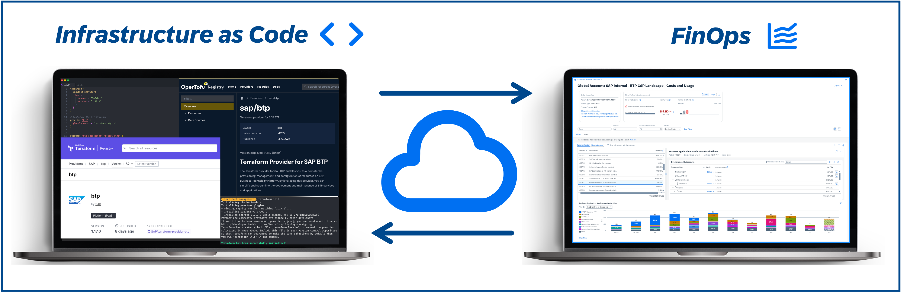

# XP263 - Advanced tools for administrators in SAP BTP

## Description

This repository contains the material for the SAP TechEd 2025 session called XP263 - Advanced tools for administrators in SAP BTP.

## Overview

In this guided exercise, participants will take on the roles of Apex Holdings administrators and a FinOps controller.

Apex Holdings is a sample global enterprise created to simulate SAP BTP administration and FinOps practices. The company operates across diverse industries - such as health, retail, energy, etc. - each represented as Subsidiary with its own BTP directory.

Within each Subsidiary, you'll find departments such as finance, sales, HR, IT, and operations with subaccounts spanning regions like EMEA, North America, APAC, LATAM, and the Middle East (represented as labels).
Each Subsidiary manages its own dedicated applications, ranging from payroll and performance reviews in HR to revenue forecasting, logistics, and customer insights.

The overall account structure mirrors a real-world organization with production, test, and development environments (represented as directories) aligned to cost centers and contact persons (represented as labels).

This session gives the attendees the opportunity to get hands-on experience with advanced administration tools in SAP Business Technology Platform (SAP BTP). It consists of two main parts:

- **Exercise 1** will give you insights on how to automate a consistent sample setup of SAP BTP accounts using **Terraform** as a foundation for using the FinOps capabilities on your accounts.
- **Exercises 2-9** will equip you as global account administrator and controller with the skills to efficiently manage, monitor, and optimize their global accounts. You will learn about the **FinOps capabilities** (management cost and usage for BTP services) available to all customers using the Apex setup. The exercises cover:
  - Exercise 2: Introduction to FinOps exercises
  - Exercise 3: Billing verification
  - Exercise 4: Monitoring costs
  - Exercise 5: Cross-charging and cost allocation
  - Exercise 6: Budget management and alerts
  - Exercise 7: Cost optimization strategies
  - Exercise 8: Cost and Usage Overview (Preview)
  - Exercise 9: Exporting data to Excel (Optional)

> [!NOTE]
> The exercises are independent. In case you get stuck in exercise 1 you can still proceed with exercises 2-9.

## Exercises

- [Getting Started](exercises/ex0/README.md#getting-started)
- [Exercise 1 - Setup of Terraform Configuration](exercises/ex1/README.md#exercise-1---setup-of-terraform-configuration)
    - [Exercise 1.1 - Understanding the Setup](exercises/ex1/README.md#exercise-11---understanding-the-setup)
    - [Exercise 1.2 - Completing the basic Terraform configuration](exercises/ex1/README.md#exercise-12---completing-the-basic-terraform-configuration)
    - [Exercise 1.3 - Adding a new subaccount](exercises/ex1/README.md#exercise-13---adding-a-new-subaccount)
    - [Exercise 1.4 - Adding the production stage](exercises/ex1/README.md#exercise-14---adding-the-production-stage)
- [Exercise 2 - Introduction to FinOps exercises](exercises/ex2/)
- [Exercise 3 - Billing Verification](exercises/ex3/)
- [Exercise 4 - Monitoring Costs](exercises/ex4/)
- [Exercise 5 - Cross Charge / Cost Allocation](exercises/ex5/)
- [Exercise 6 - Controlling Costs Using Budgets](exercises/ex6/)
- [Exercise 7 - Optimization](exercises/ex7/)
- [Exercise 8 - Cost and Usage Overview (Preview - Bonus)](exercises/ex8/)
- [Exercise 9 - Export to Excel (Optional)](exercises/ex9/)

## Contributing
Please read the [CONTRIBUTING.md](./CONTRIBUTING.md) to understand the contribution guidelines.

## Code of Conduct
Please read the [SAP Open Source Code of Conduct](https://github.com/SAP-samples/.github/blob/main/CODE_OF_CONDUCT.md).

## How to obtain support

Support for the content in this repository is available during the actual time of the online session for which this content has been designed. Otherwise, you may request support via the [Issues](https://github.com/SAP-samples/teched2025-XP263/issues) tab.

## License

Copyright (c) 2025 SAP SE or an SAP affiliate company. All rights reserved. This project is licensed under the Apache Software License, version 2.0 except as noted otherwise in the [LICENSE](LICENSES/Apache-2.0.txt) file.
