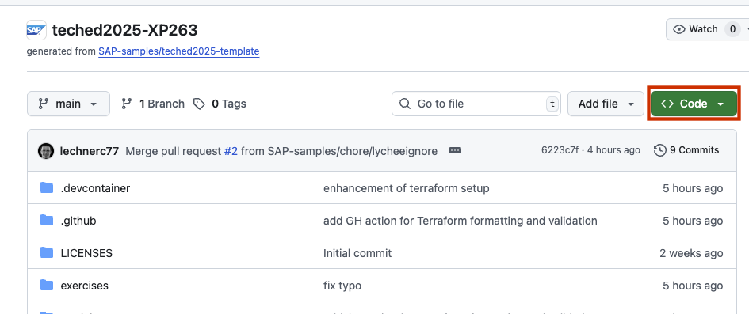
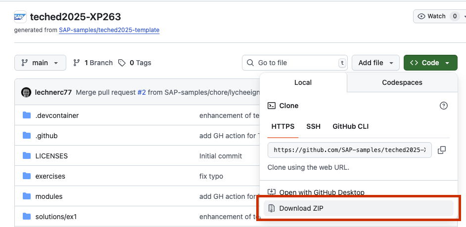
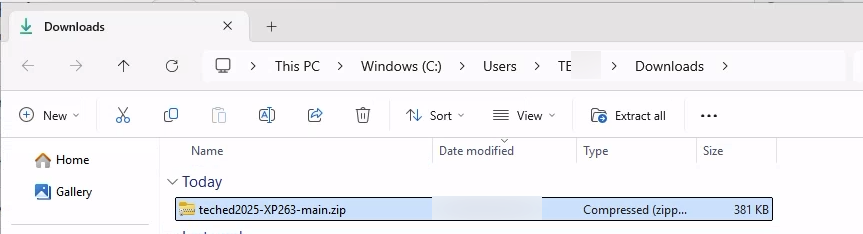
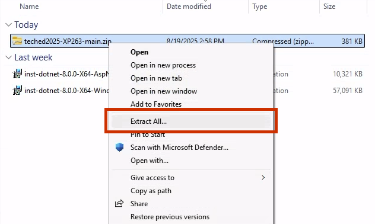
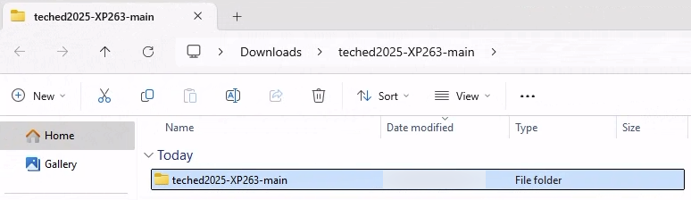
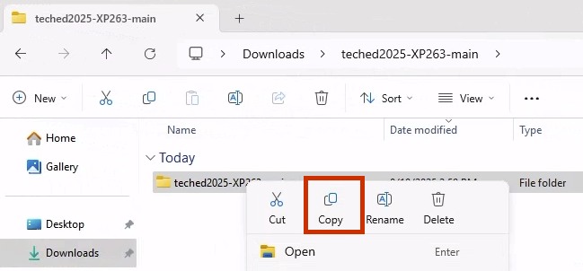
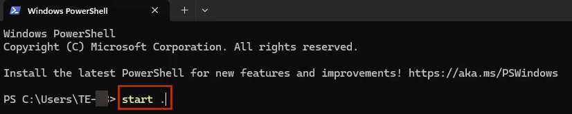
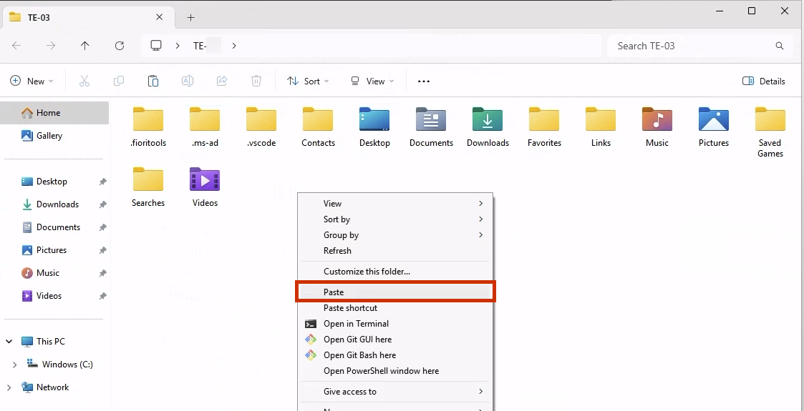

# Getting Started

In this exercise, you will learn how to do the initial setup needed for the execution of the Terraform part of the hands-on workshop.
We distinguish between two ways of doing the Terraform part of the workshop:

- Guided hands-on workshop at the SAP TechEd 2025 in Berlin
- Self-paced on your own

## Guided Hands-On Workshop at SAP TechEd 2025 in Berlin (approx. 5 minutes)

> 💻 **Note**: This part needs to be completed for SAP TechEd participants **before** continuing with [Exercise 1 - Setup of Terraform Configuration](../ex1/README.md)

The prerequisites for the hands-on workshop are already installed on the local machine provided to you. There are two steps you need to do before you can start with the first exercise of the workshop:

- Access to the SAP BTP Account
- Get the code of the workshop onto your machine

We will guide you through these two steps in the following sections.

## Access to the SAP BTP Account

We provide a dedicated SAP BTP account for each workshop place. Access the SAP BTP Account using the following data:

1. Open the following link in a browser to access the SAP BTP account: <https://emea.cockpit.btp.cloud.sap/cockpit/?idp=ainfvn15r.accounts.ondemand.com>
2. Enter the user name `XP263-XXX@education.cloud.sap`, where `XXX` is the number of your workshop place. For example: XP263-000@education.cloud.sap
3. Enter the password for your user. **The password will be provided to you at the beginning of the workshop.**

## Access to the Code Repository

There is one last step you need to do namely to download the code of this workshop to your local machine. You have two options described in the following sections.

### Option 1 - Clone the repository (recommended)

1. Open a PowerShell terminal and execute the following command:

   ```powershell
   git clone https://github.com/SAP-samples/teched2025-XP263.git
   ```

1. Navigate to the folder `teched2025-XP263`:

   ```powershell
   cd teched2025-XP263
   ```

1. Open Visual Studio Code in the current folder:

   ```powershell
   code .
   ```

You are good to go and can start with the [Exercise 1 - Setup of Terraform Configuration](../ex1/README.md).

### Option 2 - Download the code from the GitHub repository

You can also download the code from the GitHub repository as a ZIP file. To do this, follow these steps:

1. Go to the [GitHub repository](https://github.com/SAP-samples/teched2025-XP263).
1. Click on the green "Code" button.

   

1. Select "Download ZIP" from the dropdown menu.

   

This will download the code to the `Downloads` folder of your local machine as a ZIP file.

Next you must extract the ZIP file and copy the extracted folder into your users directory. To achieve this:

1. Open the `Downloads` folder in the Windows Explorer.

   

1. Right-click on the downloaded ZIP file and select "Extract All...".

   

1. Navigate into the extracted folder `teched2025-XP263` where you see another folder with the same name.

   

1. Copy the folder `teched2025-XP263` via right-click and select "Copy".

   

1. Open a PowerShell terminal and execute the command `start .` to open the folder of your user in the Windows Explorer.

   

1. Paste the copied folder into your user folder by right-clicking and selecting "Paste".

    

1. Close all open Windows Explorer windows.

1. Switch back to the PowerShell terminal and navigate into the folder `teched2025-XP263`:

    ```powershell
    cd teched2025-XP263
    ```
1. Open Visual Studio Code in the current folder:

   ```powershell
   code .
   ```

You are good to go and can start with the [Exercise 1 - Setup of Terraform Configuration](../ex1/README.md).

## Self-paced on your own

> [!IMPORTANT]
> This section is only relevant if you want to do the workshop on your own outside of the guided hands-on workshop at SAP TechEd 2025 in Berlin. If you are participating in the guided hands-on workshop, please follow the instructions in the previous section.

If you want to do the workshop on your own, you can do a local installation or use the provided dev container.

### Local Installation

The prerequisites for a local installation are:

- A *editor* of your choice. We recommend [Visual Studio Code](https://code.visualstudio.com/) with the [Terraform extension](https://marketplace.visualstudio.com/items?itemName=HashiCorp.terraform)
- The *Terraform CLI*. You can download it from the [Terraform website](https://developer.hashicorp.com/terraform/install) or install it with a package manager like [WinGet](https://learn.microsoft.com/windows/package-manager/winget/) or [brew](https://brew.sh/) depending on your OS.
- The Git CLI. You can download it from the [Git website](https://git-scm.com/downloads) or install it with a package manager like [WinGet](https://learn.microsoft.com/windows/package-manager/winget/) or [brew](https://brew.sh/) depending on your OS.

If these prerequisites are installed, you can clone the repository as described in section [Option 1 - Clone the repository](#option-1---clone-the-repository).

### Using the Dev Container

As an alternative to the local installation, you can use the provided dev container that contains all required tools. This requires that you have [Docker](https://www.docker.com/products/docker-desktop) installed on your machine. In addition you need the dev container extension for Visual Studio Code. You can find detailed instructions about the setup [here](https://code.visualstudio.com/docs/devcontainers/containers#_getting-started).
In addition, you must have the repository code available on your local machine by either cloning the repository as described in section [Option 1 - Clone the repository](#option-1---clone-the-repository) or downloading the code from the GitHub repository as described in section [Option 2 - Download the code from the GitHub repository](#option-2---download-the-code-from-the-github-repository).

To start a dev container Docker must be running on your machine.

To use the dev container you must open the folder that contains the cloned repository in Visual Studio Code.

You can open the folder in the dev container:

1. Open the command palette in Visual Studio Code:

    - Windows / Linux: `Ctrl + Shift + P`
    - Mac: `Cmd + Shift + P`

1. Enter `Dev Containers: Reopen in Container` and confirm with `Enter`.

1. You will then be asked to select a dev container. Select the `TechEd 2025 XP263` container.

The dev container will automatically start and you are ready to go.

## Summary

Now that you have set up the prerequisites, you can start with the first exercise of the workshop.

[← Previous: Overview](../../README.md) | [Continue to: Exercise 1 - Setup of Terraform Configuration](../ex1/README.md)
