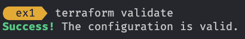
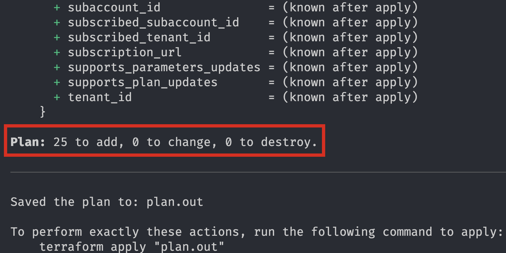

# Exercise 1 - Setup of Terraform Configuration

In this exercise, we will walk through a setup of an SAP BTP account structure consisting of directories, subaccounts and several other resources. We will use [Terraform](https://developer.hashicorp.com/terraform) to automate the creation of these resources.

Terraform is the de-facto industry standard when it comes to infrastructure as code. It allows you to define your infrastructure in a declarative way and manage it through version control.

## Exercise 1.1 - Understanding the Setup

After completing these steps, you will have an understanding of the preconfigured setup that we will use in this exercise.

The goal of our Terraform configuration is to create a multistage SAP BTP account structure. This structure on SAP BTP is given by:

- One main directory representing a subsidiary of your company
- Three directories represent the different stages of your development process: development, test and production
- Each directory contains one or more subaccounts. Each subaccount represents a specific application used by a business department in your company
- Each subaccount contains several resources like entitlements, a Cloud Foundry environment etc.

You find the baseline for this configuration in the folder [`infra`](infra/). Let us shortly walk through the files to get an overview of the setup:

- The configuration of the Terraform provider is done in the file [`provider.tf`](infra/provider.tf). This file contains the configuration for the Terraform provider for SAP BTP, namely the version constraints as well as the authentication information.
- As an input for the configuration we use the file [`variables.tf`](infra/variables.tf). This contains the parameters for the configuration of the Terraform provider and other data to configure your SAP BTP account, like the information about the contact person and cost centers for the subaccounts.
- The magic happens in the file [`main.tf`](infra/main.tf). This file contains the main configuration for the SAP BTP account structure. Let's take a closer look at this file:
  - First, we define a local variable `stages` that contains the stages of our development process:

    ```terraform
    locals {
      stages = ["Dev", "Test"]
    }
    ```

  - Then we setup the main directory for our subsidiary applying some naming conventions based on the subsidiary name:

    ```terraform
    resource "btp_directory" "main" {
      name        = "SUB: ${var.subsidiary_name}"
      description = "The parent directory for the subsidiary ${var.subsidiary_name}."
    }
    ```

  - The next section creates the directories for the different stages of our development process. We use a `for_each` loop to create one directory for each stage defined in the local variable `stages`:

    ```terraform
    resource "btp_directory" "stage" {
      for_each = toset(local.stages)

      name        = upper(each.value)
      description = "The directory for the ${each.value} stage of the subsidiary ${var.subsidiary_name}."
      parent_id   = btp_directory.main.id
    }
    ```
  - Finally, we create the subaccounts for each stage. We delegate this via a local [module](../../modules/sap-btp-subaccount-setup/README.md). We use again a `for_each` loop to create one subaccount for each stage:

    ```terraform
    module "sap-btp-subaccount-setup" {
      source   = "../../modules/sap-btp-subaccount-setup"
      for_each = toset(local.stages)

      parent_id       = btp_directory.stage[each.key].id
      stage           = each.key
      subsidiary_name = var.subsidiary_name
      subaccounts     = var.subaccounts
    }
    ```

The module [`sap-btp-subaccount-setup`](../../modules/sap-btp-subaccount-setup/README.md) contains the details of the subaccount setup namely:

- The creation of the subaccount itself including naming conventions
- The creation of the entitlements for the subaccount based on the stage
- The creation of the Cloud Foundry environment for the subaccount
- The creation of application subscriptions and service instances for the subaccount based on the stage

> [!NOTE]
> Feel free to further explore the content and the modules used in the configuration. You can find the modules in the folder [`modules`](../../modules/).

With that we are ready to make the necessary adjustements and deploy the setup to SAP BTP.

> [!CAUTION]
> The setup we are using here is a setup for demo purposes only. It is not meant to be used in a production environment. The setup is designed to enable a simple and quick local deployment of a multistage SAP BTP account structure. In a productive scenario you would certainly split the setup and define a more granular orchestration via a CI/CD environment to avoid a monolithic state file.

## Exercise 1.2 - Completing the basic Terraform configuration

After completing these steps, you will have a first deployment of your Terraform configuration to SAP BTP.

Inside of the folder [`infra`](infra/) you find a file called [`sample.tfvars`](infra/sample.tfvars). This file contains the *values* for the variables that you want to use for your configuration. Execute the following steps:

1. Rename the file to `terraform.tfvars`. Due to this naming Terraform will directly use this file as input for the configuration.
1. Open the file `terraform.tfvars`. You will find values for the variables defined in [`variables.tf`](infra/variables.tf).
1. Fill in the values for the variables `globalaccount`, `username`, `password` and `idp`. You can find these values in your SAP BTP account.
1. Save the file.

With this we are ready to deploy the configuration. To do so, execute the following open a PowerShell terminal window and navigate to the folder `infra`. Execute the following commands:

1. Initialize the Terraform configuration:

   ```powershell
    terraform init
   ```

    This command will download the necessary provider plugins and initialize the Terraform configuration. The output should look like this (version numbers may vary):

    

1. Make sure that the configuration is formatted correctly:

   ```powershell
   terraform fmt
   ```

1. Make sure that the configuration is formatted correctly:

   ```powershell
   terraform validate
   ```

   The output should look like this:

   

1. Create a plan for the deployment and store it as `plan.out`:

   ```powershell
   terraform plan -out=plan.out
   ```

    The output is quite lengthy, but at the end you should see a summary of the resources that will be created, modified or destroyed. The output should look like this (number of resources may vary):

    

1. Apply the stored plan and execute the deployment:

   ```powershell
   terraform apply plan.out
   ```

   This command will create the directories, subaccounts and other resources defined in the configuration. This will take a bit. You can follow the progress in the terminal as well as in the SAP BTP cockpit.

Once the deployment is finished, you see a summary of the resources that were created. The output should look like this (number of resources may vary):


Check the setup in the SAP BTP cockpit. You see the newly created directories and subaccounts.

As Terraform keeps track of the state of the resources via a so called *state file*, you can also check the resources created by Terraform in the file `terraform.tfstate`. To do so execute the command:

```powershell
terraform state list
```

Let's enhance the configuration further by adding a new subaccount.

## Exercise 1.3 - Adding a new subaccount

After completing these steps, you will have enhanced and deployed the Terraform configuration with an additional subaccount.

The creation of the subaccounts is triggered by the values we provide for the variable `subacounts`. To add a new subaccount, add a new value to the variable `subaccounts` in the file `terraform.tfvars`.

- Open the file `terraform.tfvars`.
- Add the values for a new subaccount that represents a financial app to the variable `subaccounts`. The identifier is `Fin App 1`, the `region` is `us10`, the `cost_center` is `CC67890` and the `contact_person` is `carter.burke@weyland-corp.com`. The result should look like this:

  ```terraform
  subaccounts = {
    "Sales App 1" = {
      region         = "eu10"
      cost_center    = "CC12345"
      contact_person = "michael.bishop@weyland-corp.com"
    },
    "Fin App 1" = {
      region         = "us10"
      cost_center    = "CC67890"
      contact_person = "carter.burke@weyland-corp.com"
    }
  }
  ```

- Save the file.

Let us deploy the changes to SAP BTP. To do so, execute the following commands in the PowerShell terminal:

1. Make sure that the configuration is formatted correctly:

   ```powershell
   terraform fmt
   ```

1. Make sure that the configuration is formatted correctly:

   ```powershell
   terraform validate
   ```

1. Create a plan for the deployment and store it as `plan.out`:

   ```powershell
   terraform plan -out=plan.out
   ```

    You see that the change that will be applied is only affecting the new subaccount. As you did not change anything for the existing subaccounts.

1. Apply the stored plan and execute the deployment:

   ```powershell
   terraform apply plan.out
   ```

Once the deployment is finished, you see a summary of the resources that were created. Check the setup in the SAP BTP cockpit. Besides the already existing subaccounts you also see the newly added ones per stage.

## Exercise 1.4 - Adding the production stage

After completing these steps, you will have enhanced and deployed the Terraform configuration with an additional stage representing the subacounts used for production.

As we are confident with the setup, you can now enhance the configuration to include a production stage. This is done by adding the stage `Prod` to the local variable `stages` in the file `main.tf`.

1. Open the file `main.tf` in the folder `infra`.
1. Add the stage `Prod` to the local variable `stages`. The result should look like this:

   ```terraform
   locals {
     stages = ["Dev", "Test", "Prod"]
   }
   ```
1. Save the file.

You are already an expert in deploying the configuration, so you can now deploy the changes to SAP BTP. To do so, execute the following commands in the PowerShell terminal:

1. Make sure that the configuration is formatted correctly:

   ```powershell
   terraform fmt
   ```

1. Make sure that the configuration is formatted correctly:

   ```powershell
   terraform validate
   ```

1. Create a plan for the deployment and store it as `plan.out`:

   ```powershell
   terraform plan -out=plan.out
   ```

    You see that the change that will be applied is only affecting the new stage. As you did not change anything for the existing stages.

1. Apply the stored plan and execute the deployment:

   ```powershell
   terraform apply plan.out
   ```

Once the deployment is finished, you see a summary of the resources that were created. Check the setup in the SAP BTP cockpit. Besides the already existing directories and subaccounts for the stages `Dev` and `Test` you also the newly added ones for the stage `Prod`.

> [!NOTE]
> You can also delete the complete setup in one run via the command `terraform destroy`. This will delete all resources created by Terraform in the current state. The command will present you a plan what it will destroy. Review and carefully and approve the action by typing `yes` when prompted.

## Summary

You've now finished all steps to setup a multistage SAP BTP account structure using Terraform. You have learned how to create directories, subaccounts, and other resources in a structured way.

Continue to - [Exercise 2 - Exercise 2 Description](../ex2/README.md)

## Additional Resources

- [Getting Started with Terraform on SAP BTP](https://learning.sap.com/learning-journeys/getting-started-with-terraform-on-sap-btp) on learning.sap.com
- [SAP BTP Administrator's Guide](https://help.sap.com/docs/btp/btp-admin-guide/btp-admin-guide)
- [SAP BTP - Administrator's Guide Samples](https://github.com/SAP-samples/btp-admin-guide-samples)


