# Exercise 1 - Billing Verification

## 🎯 Overview

**Verify Billing vs. Balance Statement**: The balance statement (available in SAP for Me) is the starting point for your cross-checking the BTP cost information. Verifying your balance statement is recommended to be done monthly once the balance statement has been generated. As the next step you may investigate and further analyze the costs of the BTP Cockpit.

You can use the Billing view to display, monitor, and analyze your monthly charges of billable services, which have been consumed by the subaccounts in your global account over the last 12 months. The Billing view is split into two perspectives:

- **View by Service** – more suitable for billing verification as it presents all the services ordered as in the balance statement to enable analysis of the service costs and usage.
- **View by Account** – better suited for cross charging as it presents the account hierarchy including subaccounts and directories to enable analysis of the account entity costs and usage.

```mermaid
flowchart TD
    A[📄 Balance Statement<br/>SAP for Me] --> B{Navigate to<br/>BTP Cockpit}
    B --> C[📊 Costs and Usage<br/>View by Service]
    C --> D[Compare Service Costs]
    D --> E[Verify Cloud Credits]
    E --> F[Analyze Cost Trends]
    F --> G{Verification<br/>Complete?}
    G -->|Yes| H[✅ Billing Verified]
    G -->|Issues Found| I[🔍 Investigate Discrepancies]
    I --> D
```

<div align="center">



</div>

---

## 📍 Orientation


### Navigation Steps

- [ ] In the BTP Cockpit, under the left pane navigate to the last page → **Costs and Usage**
- [ ] In the header, inside the **Global Account Info** card (card on the left), click on the link "Important information about your billing and usage data"
- [ ] Review that your global account is licensed for both the consumption-based and subscription-based commercial models
- [ ] In the header, locate the **Cloud Platform Enterprise Agreement** card (card on the right) presenting the Cloud Credits costs, status and trend
- [ ] In the Costs and Usage header, set the **Month filter** to the previous month

> [!IMPORTANT]
> **Billing Structure**: Your account uses a hybrid model where prepaid quota from your subscription is utilized first, after which any excess usage is charged under the consumption-based model.

<details>
<summary>📖 <b>Understanding Commercial Models</b></summary>

### Consumption-Based Model
Pay only for what you use, billed monthly based on actual service consumption.

### Subscription-Based Model
Prepaid quota allocated upfront. Once exhausted, additional usage falls under consumption-based pricing.

### Hybrid Model (Your Account)
Combines both models: subscription quota is consumed first, then overages are charged at consumption rates.

</details>

---

## 📊 Compare the Balance Statement and SAP BTP Cockpit Information

> [!NOTE]
> For this exercise, we will provide screen shots from the **October 2025** balance statement. The balance statement is split into a few sections which you can see via the Blue headings.


### Initial Setup

- [ ] In the Costs and Usage, verify you are viewing **Billing view → View By Service** display
- [ ] Confirm the list is sorted according to the **Product (SKU)** as in the balance statement
- [ ] Note that this view includes both services with and without costs (see List Price column)
- [ ] Choose **"Show only services with charged usage"** to filter out services with $0 cost

> [!TIP]
> The balance statement displays only services with costs, so filtering to "Show only services with charged usage" makes comparison easier.

### 💰 Section 1: Total Consumption Services


**Verification Task**: Compare the first 3 services listed in the balance statement under section **'Total Consumption'** with the information in the Costs and Usage.

- [ ] Compare the **Usage** column values
- [ ] Compare the **Prepaid quota** column values
- [ ] Compare the **Charged Usage** column values

<details>
<summary>❓ <b>Need help understanding these columns?</b></summary>

Click the information icon (ℹ️) on the Costs and Usage page for detailed explanations of:
- **Usage**: Total service consumption for the period
- **Prepaid quota**: Allocated subscription quota used
- **Charged Usage**: Consumption beyond prepaid quota that incurs charges

</details>

### 💳 Section 2: Cloud Platform Enterprise Agreement Services


**Verification Task**: Compare the first 3 services in the balance statement under section **'Cloud Platform Enterprise Agreement'** with the Costs and Usage page.

- [ ] Compare the **List Price** column values between both sources

> [!NOTE]
> **Key Insight**: The Costs and Usage page aggregates the balance statement sections into a single unified view. This enables you to see the information per service together and drill down into the details of each service to better understand how its costs were generated.

### 🏦 Section 3: Cloud Credits and Payment Summary


**Verification Task**: Compare the 'Total net value of service consumed' and cloud credits.

- [ ] In the Costs and Usage header, expand the **Cloud Platform Enterprise Agreement** card (card on the right)
- [ ] Hover over the **October bar** to view the cloud credits used

#### Cloud Credits Calculation

> [!IMPORTANT]
> **Apex Holdings Context**: As a holding company with multiple subsidiaries, Apex expanded its contract with the following cloud credit structure:

| Metric | Amount |
|--------|--------|
| Cloud credits for current period | $8.3 M |
| Cloud credits used (balance) | $5.6 M |
| **Remaining cloud credits** | **$2.7 M** |

The remaining cloud credits calculation:

$$
\text{Remaining Credits} = \text{Period Credits} - \text{Used Credits}
$$

$$
\$2.7\text{M} = \$8.3\text{M} - \$5.6\text{M}
$$

**Verification Steps**:

- [ ] Verify the Cloud Platform Enterprise Agreement card shows **$8.3 M** for the current period
- [ ] Verify the balance shows **$5.6 M** used
- [ ] Confirm remaining cloud credits show **$2.7 M**
- [ ] Compare the remaining **$2.7 M** to the 'Closing Cloud Credit balance as of 30, Oct 2025' in the balance statement

> [!NOTE]
> **No Overages**: Since there are remaining cloud credits, the balance statement shows a 'Net Overage Amount' of $0. This indicates there are no overages, and therefore you can see in the 'Payment Summary', no additional costs to be paid.

### ✅ Verification Checkpoint

**Question**: Did the billing verification confirm that all charges are accurate?

<details>
<summary><b>Click to reveal answer</b></summary>

**Answer**: Yes

All service costs match between the balance statement and BTP Cockpit. The cloud credits calculation is correct ($8.3M - $5.6M = $2.7M remaining), and there are no unexpected overages.

</details>

<details>
<summary>📋 <b>Verification Checklist Summary</b></summary>

| Verification Item | Status |
|------------------|--------|
| Total Consumption services match | ⬜ |
| CPEA services match | ⬜ |
| Cloud credits calculation correct | ⬜ |
| Remaining balance matches | ⬜ |
| No unexpected overages | ⬜ |

</details>

---

## 📈 Analyze the Overall Global Account Cost Trend

### View the Cost Trend Graph

- [ ] Scroll down to view the graph presenting the **Global Account - Cost Summary**
- [ ] Choose **View By: List Price**
- [ ] Review the cost trend for the last 12 months
- [ ] Hover over the bars to see the estimated costs in November

<div align="center">


</div>

### Cost Trend Analysis

### ✅ Verification Checkpoint

**Question**: Which month has the highest costs over the last 12 months?

<details>
<summary><b>Click to reveal answer</b></summary>

**Answer**: October

October 2025 shows the highest costs over the 12-month period, continuing the upward trend that requires further investigation.

</details>

> [!IMPORTANT]
> **Understanding Estimated Costs**: In November (current month), the estimated costs are displayed as **striped bars**. These values cover the period between the last balance statement and today.
>
> **Key Points**:
> - Based on raw resource usage data before final aggregation for billing
> - May change once the billing cycle closes and balance statement is issued
> - **Not forecast values** – they represent actual usage to date, not projected future usage

### 🔍 Cost Growth Observation

> [!WARNING]
> **Trend Alert**: Since the last cost reduction project in Apex, there has been a constant trend of **cost growth**. We'll investigate this in the next section.

<details>
<summary>💡 <b>Potential Investigation Areas</b></summary>

When investigating cost growth trends, consider:

1. **New Services**: Were new services added?
2. **Increased Usage**: Did existing services scale up?
3. **Development Activity**: Are dev/test environments properly managed?
4. **Resource Optimization**: Are resources right-sized?
5. **Idle Resources**: Are there unused or underutilized services?

</details>

---

## 📚 Summary

In this exercise, you learned how to:

- ✅ Navigate the BTP Cockpit Costs and Usage interface
- ✅ Compare balance statement data with BTP Cockpit information
- ✅ Verify service costs across different billing sections
- ✅ Calculate and validate cloud credit balances
- ✅ Analyze cost trends over a 12-month period
- ✅ Identify potential areas for cost investigation

> [!TIP]
> **Next Steps**: Use the insights from this billing verification to guide deeper cost analysis and optimization efforts in the following exercises.

---

## 📚 Reference Materials

<details>
<summary>📖 <b>Glossary of Terms</b></summary>

### Billing & Financial Terms

| Term | Definition |
|------|------------|
| **Balance Statement** | A monthly financial document from SAP that details all charges, credits, and payment information for your BTP consumption |
| **Charged Usage** | Consumption beyond prepaid quota that incurs additional charges at consumption rates |
| **Cloud Credits** | Prepaid monetary value applied to BTP service consumption under a Cloud Platform Enterprise Agreement |
| **Cloud Platform Enterprise Agreement (CPEA)** | An enterprise contract providing cloud credits for SAP BTP services, often with volume discounts |
| **Consumption-Based Model** | A pricing model where you pay only for actual service usage, billed monthly |
| **Hybrid Billing Model** | A combination of subscription and consumption billing where prepaid quota is used first |
| **List Price** | The standard published price for a service before any discounts or credits |
| **Net Overage Amount** | Charges exceeding cloud credits that require additional payment |
| **Prepaid Quota** | Service allocation included in your subscription that doesn't incur additional charges when used |
| **Subscription-Based Model** | A pricing model with upfront payment for a committed level of service |

### BTP Technical Terms

| Term | Definition |
|------|------------|
| **Global Account** | The top-level container for your SAP BTP resources, representing your entire BTP environment |
| **Subaccount** | A subdivision of a global account, typically representing a project, department, or environment |
| **Directory** | A folder-like container to organize multiple subaccounts |
| **Service** | A cloud offering available on BTP (e.g., HANA Cloud, Cloud Foundry, Integration Suite) |
| **SKU (Stock Keeping Unit)** | A unique identifier for a specific service offering and pricing plan |
| **Usage Metrics** | Measurements of consumption (e.g., GB-hours, API calls, compute hours) |

### FinOps Terms

| Term | Definition |
|------|------------|
| **Chargeback** | Billing internal teams/departments for their actual cloud usage |
| **Showback** | Reporting cloud costs to teams without actual billing/transfer of funds |
| **Right-sizing** | Adjusting resource allocation to match actual usage needs, eliminating over-provisioning |
| **Cost Allocation** | The process of assigning cloud costs to specific business units or cost centers |
| **Burn Rate** | The rate at which cloud credits or budget is being consumed |
| **Run Rate** | Current monthly spending extrapolated over a longer period (e.g., annual run rate) |

</details>

<details>
<summary>🎯 <b>Quick Reference Card</b></summary>

### Key Formulas

| Calculation | Formula |
|-------------|---------|
| **Remaining Credits** | `Period Credits - Used Credits` |
| **Charged Usage** | `Total Usage - Prepaid Quota` |
| **Service Cost** | `Charged Usage × Rate` |
| **Growth Rate** | `(Current - Previous) / Previous × 100%` |
| **Burn Rate** | `Credits Used / Months Elapsed` |
| **Projected Depletion** | `Remaining Credits / Monthly Burn Rate` |

### Navigation Quick Reference

| Action | Location | Shortcut |
|--------|----------|----------|
| Access Costs & Usage | Left Nav → Bottom of list | Bookmark it! |
| Change Month | Top header → Month filter | - |
| Filter Services | "Show only services with charged usage" checkbox | - |
| View Service Details | Click service name in table | - |
| Export Data | Top right → Export button | - |
| View Balance Statement | SAP for Me → Billing & Payment | - |

### Verification Checklist (One-Page)

```
☐ Navigate to Costs and Usage
☐ Set month filter to verification period
☐ Enable "Show only services with charged usage"
☐ Verify Total Consumption services
☐ Verify CPEA services
☐ Validate cloud credits calculation
☐ Confirm no unexpected overages
☐ Review cost trend graph
☐ Identify highest cost month
☐ Document findings
☐ Communicate to stakeholders
```

### When to Escalate

| Situation | Severity | Action |
|-----------|----------|--------|
| < $100 discrepancy | 🟢 Low | Document, monitor |
| $100-$1000 discrepancy | 🟡 Medium | Email support |
| > $1000 discrepancy | 🔴 High | Create support ticket |
| Cloud credits exhausted | 🔴 Critical | Alert CFO immediately |
| Growth > 15% MoM | 🟡 Medium | Cost review meeting |
| Growth > 30% MoM | 🔴 High | Emergency cost reduction |

</details>

<details>
<summary>🔗 <b>Useful Links & Documentation</b></summary>

### Official SAP Documentation

| Resource | URL | Description |
|----------|-----|-------------|
| **BTP Cockpit Guide** | [help.sap.com/btp-cockpit](https://help.sap.com/docs/btp-cockpit) | Comprehensive guide to navigating and using BTP Cockpit |
| **Cost and Usage Analytics** | [help.sap.com/btp-usage](https://help.sap.com/docs/btp/cost-usage) | Detailed documentation on cost tracking features |
| **Commercial Models** | [help.sap.com/btp-pricing](https://help.sap.com/docs/btp/commercial-models) | Understanding consumption vs. subscription pricing |
| **Cloud Credits FAQ** | [help.sap.com/cpea](https://help.sap.com/docs/cpea) | Everything about Cloud Platform Enterprise Agreements |
| **BTP Pricing** | [sap.com/btp-pricing](https://www.sap.com/products/technology-platform/pricing.html) | Current pricing for BTP services |

### Support & Community

| Resource | URL | Description |
|----------|-----|-------------|
| **SAP Support Portal** | [support.sap.com](https://support.sap.com) | Create support tickets, access knowledge base |
| **SAP Community** | [community.sap.com](https://community.sap.com) | Forums, blogs, Q&A |
| **SAP for Me** | [me.sap.com](https://me.sap.com) | Access balance statements, contracts, licensing info |
| **BTP Status** | [status.sap.com](https://status.sap.com) | Service availability and incident notifications |

### Learning Resources

| Resource | URL | Description |
|----------|-----|-------------|
| **SAP Learning Hub** | [learning.sap.com](https://learning.sap.com) | Official training courses |
| **openSAP** | [open.sap.com](https://open.sap.com) | Free online courses |
| **SAP TechEd** | [sap.com/teched](https://www.sap.com/events/teched.html) | Annual technology conference |
| **FinOps Foundation** | [finops.org](https://www.finops.org) | Cloud financial management best practices |

### Tools & Calculators

| Resource | Purpose |
|----------|---------|
| **BTP Estimator** | Estimate costs for planned BTP usage |
| **Cloud Credits Calculator** | Track credit consumption and burn rate |
| **ROI Calculator** | Assess return on BTP investments |

> [!NOTE]
> **Bookmark These**: Save the most relevant links for quick access during your daily work.

</details>

<details>
<summary>💻 <b>BTP Cockpit Tips & Tricks</b></summary>

### Navigation Shortcuts

1. **Breadcrumb Navigation**: Use the breadcrumb trail at the top to quickly navigate back to parent levels
2. **Recent Items**: Check "Recent" in the left nav for frequently accessed accounts
3. **Favorites**: Star your most-used subaccounts for quick access
4. **Search**: Use the global search (top right) to find subaccounts or services

### Data Export Tips

1. **Export Formats**: Choose CSV for Excel analysis, JSON for programmatic processing
2. **Date Ranges**: Export multiple months to create your own trend analysis
3. **Filtering**: Apply filters before exporting to get only relevant data
4. **Automation**: Use BTP CLI or APIs for scheduled exports

### Visualization Tips

1. **Full Screen Charts**: Click the expand icon on charts for better visibility
2. **Compare Periods**: Use the comparison view to see month-over-month changes
3. **Drill-Down**: Click any data point in charts to see underlying details
4. **Custom Views**: Save your preferred filter combinations

### Performance Optimization

1. **Browser**: Chrome or Edge recommended for best performance
2. **Cache**: Clear browser cache if data doesn't update
3. **Refresh**: Use manual refresh button rather than browser refresh for faster updates
4. **Bookmarks**: Bookmark specific filtered views to skip navigation steps

### Mobile Access

1. **Responsive Design**: BTP Cockpit works on tablets
2. **Mobile App**: Consider SAP Mobile Start for notifications
3. **Offline**: Export data before traveling for offline analysis

### Troubleshooting Common Issues

| Issue | Solution |
|-------|----------|
| Data not updating | Click "Refresh" button; check "Last Updated" timestamp |
| Missing services | Verify month filter; check "Show all services" option |
| Export failing | Reduce date range; try different format |
| Slow loading | Clear browser cache; try different browser |
| Charts not rendering | Enable JavaScript; check browser compatibility |

</details>

---
