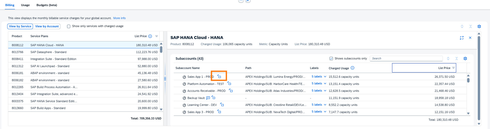

# Exercise 2 - Monitoring cost and consumption

## Introduction

In this section, you will monitor costs and resource consumption by comparing services and subaccounts, analyzing trends, and drilling into detailed data. The objective is to identify the reasons behind the cost increase in October (the previous month), which was identified in the previous exercise as the month with the highest costs over the past 12 months.

> [!NOTE]
> You can expand  the table at any time to increase the visible area and view more data.

## Investigate and monitor the cost increase in the previous month

1. In the Costs and Usage header, ensure that the filter for Month is set to the previous month.
2. The default view displays Billing → View By Service

> [!TIP]
> Sort the List Price column in descending order to organize the services by cost.

3. Which service plan has the highest cost?

   

   
Answer

   **SAP HANA Cloud - HANA**

   SAP HANA Cloud is a database-as-a-service offering that typically represents a significant cost component in BTP environments. As the service plan with the highest cost, it will be a key focus area for investigating the October cost increase.
   

    

4. Make sure no service is selected in the table. Scroll down to view the graph presenting the Global Account - Cost Summary and choose View By: Cost Breakdown. The graph presents the costliest services in your global account over the last 12 months.
   1. Expand the graph
   2. Look for the service plan with the highest cost which you found in the previous step. Review the trend, has there been an increase in the costs of this service plan in the previous month vs. the month before?

      

      
Answer

      **Yes**

      There has been a noticeable increase in SAP HANA Cloud - HANA costs in the previous month compared to the month before. This upward trend contributes to the overall cost increase observed in October and requires further investigation to identify the specific subaccounts driving this growth.
      

       

   3. This explains some of the increase in the overall previous month costs. Let's see why this increase occurred. Close the expanded graph view to see the full Billing table
5. Select the service plan with the highest costs (as identified in step #3).
6. You can see on the right-hand side the service plan details and find all subaccounts that use this service plan.

> [!TIP]
> Check "Shows subaccounts only" and sort the List Price Column by descending.

7. What is the Subaccount with the highest costs in the previous month using this service plan?

   

   
Answer

   **Sales App 1 – PROD**

   This production subaccount is the primary consumer of SAP HANA Cloud - HANA services in the previous month. Identifying the specific subaccount allows you to drill deeper into understanding when and why these costs began, and whether they represent expected growth or an anomaly requiring attention.
   

    

   

8. For this subaccount click on the switch button (see highlighted in screen shot above). This action will take you to the 'View by Account', where you can view the subaccount's costs and usage within the account hierarchy.
9. Scroll down to the graph and view the Cost Breakdown by Service Plans. Can you find a reason for the increase in the previous month?

   

   
Answer

   **Sales App 1 – PROD** subaccount began incurring costs last month mainly due to the use of **SAP HANA Cloud – HANA** service plan, which helps explain part of the overall cost increase.
   

    

10. Close the subaccount detailed information (on the right-hand side).

## Summary

In this section, you have learned:

**Cost Investigation & Root Cause Analysis:**
- ✅ Investigate cost increases by identifying the highest-cost service plans (e.g., SAP HANA Cloud - HANA)
- ✅ Analyze cost trends over time to distinguish between sustained growth and temporary spikes
- ✅ Drill down from service-level costs to specific subaccounts to pinpoint consumption sources
- ✅ Trace the timeline of cost changes to understand when new services or workloads were introduced

**Advanced Navigation & Comparison:**
- ✅ Navigate seamlessly between "View by Service" and "View by Account" perspectives using the switch button
- ✅ Sort and filter data by cost columns to prioritize investigation efforts
- ✅ Use the "Shows subaccounts only" filter to focus analysis on specific consumption units
- ✅ Interpret Cost Breakdown graphs to visualize service plan distribution

**Data-Driven Decision Making:**
- ✅ Connect cost data to business context (e.g., identifying new production subaccounts causing cost growth)
- ✅ Distinguish between expected growth and unexpected cost anomalies requiring action

---

Continue to: [Exercise 5 - Optimization](05-optimization.md)
