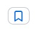

# Exercise 3 - Cross charge / distribution

## Introduction

Cross charging is an accounting and cost allocation practice where one part of an organization charges another part of the same organization for services or resources provided. It's often used in large enterprises, especially holding companies or businesses with multiple subsidiaries, divisions, or departments. This internal process ensures costs are fairly distributed, and each business unit reflects the true expense of the services it consumes.

In this section, you will track costs within the Apex account hierarchy to effectively share and distribute expenses across the organization. This process primarily utilizes the account structure, along with search and filter options based on labels.

You may also use the option available to export the data to Excel for further tracking and cross charging. This optional exercise is available at the end of the hands-on session (if time permits).

## Track costs and cross charge using the Account hierarchy

1. In the Costs and Usage header, ensure that the filter for Month is set to the previous month.
2. Ensure that you are in the Billing → View by Account and click on the collapse all button to view the Account hierarchy.
3. You will see 5 Subsidiaries and a list of subaccounts. These are subaccounts that had cost or usage during the last 12 months and were deleted.
4. Select subsidiary NexaTech Digital, what is the cumulative list price in the last 12 months?

   > [!TIP]
   > Scroll down to the graph and choose View by: Cumulative List Price.

   

   
Answer

   **1,887,337.35**
   

    

5. Unselect subsidiary NexaTech Digital.
6. What subaccount has the highest costs in the previous month?

   > [!TIP]
   > Select "Show only subaccounts" and sort the List Price column in descending order to organize the services by cost.

   

   
Answer

   **HR App 4 – TEST**
   

    

   1. Was the previous month the highest cost period for this SA in the last 12 months?

      > [!TIP]
      > Select this subaccount and scroll down to the graph, choose View by: List Price.

      

      
Answer

      **Yes**
      

       

   2. Which is the costliest service plan they used?

      > [!TIP]
      > In the graph choose View by: Cost Breakdown by Service Plans.

      

      
Answer

      **SAP Integration Suite, advanced event mesh - Default**
      

       

   3. To investigate this subaccount – view the labels assigned to it.
   4. You may contact the owner of this subaccount to inform them that they have crossed the 40k USD in the previous month. Who is the contact person?

      > [!TIP]
      > View the labels of this subaccount.

      

      
Answer

      **logan.ibrahim@apex.com**
      

       

   5. View the Environment for this subaccount. You might notice something interesting - the environment is labeled as "Test", indicating it's used for testing purposes. Typically, production environments incur higher costs than test environments.
   6. Bookmark subaccount HR App 4 – TEST for future tracking by searching for the subaccount and bookmarking the browser tab. Copy the link by clicking the bookmark icon . This enables to save the link and send it to other global account admins for further tracking.

7. Unselect the subaccount and deselect the "Show only subaccounts".

## Cross charge using Labels

1. Ensure that the filter for Month is set to the previous month.
2. Check the overall Tests cost in Apex by typing in the Search box Environment and choose Environment: Test costs. What are the costs?

   

   
Answer

   **221,821.91 USD**
   

    

3. As you saw, subaccount HR App 4 - TEST is in EMEA, what are the cost for the whole Apex EMEA region?

   > [!TIP]
   > Search for the label Region and choose Region: EMEA or you may search for EMEA (similar to the previous step).

   

   
Answer

   **362,710.05 USD**
   

    

4. You also saw the Department for this subaccount is HR, what are the overall cost for HR in the previous month? In order to charge them back for their usage.

   

   
Answer

   **156,097.00**
   

    

## Summary

In this section, you have learned:

- Track and compare costs within the account hierarchy
- Use labels to filter and aggregate costs across the account
- Cross charge expenses using the account hierarchy and labels
- Bookmark and share key information for ongoing tracking and collaboration

---
