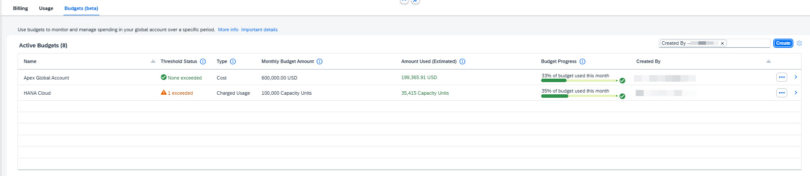

# Exercise 2.4 - Controlling Costs Using Budgets

## Exercise 2.4.1 - Introduction

In this section, you will learn to manage, control, and optimize cloud spending using **Budgets**. Budgets allow you to better control your global account spending and plan for future consumption by setting up budget limits for your global account in **SAP BTP**.

> [!NOTE]
> **Budgets** track actual consumption charges, not prepaid quota usage. This helps you focus on controlling costs that directly impact your bill.

### Budget Thresholds

By default, each budget includes three budget thresholds defined for **80%**, **90%**, and **100%** of the budget amount. You can customize these thresholds by unchecking them or changing the percentage values to match your organization's needs.

### Alert Options

When budget thresholds are reached, multiple alert options are available (you can use all options or choose the ones that fit best):

1. **Visual Indicators**: In the Costs and Usage page, visual indicators show the threshold status (0-3 threshold exceedances) for quick at-a-glance monitoring.

2. **Automatic Email Alerts**: Automatically send alert emails to Global Account Administrators. You can enable this option when creating a new budget. Once a defined threshold is exceeded, an email notification will be sent to all Global Account Administrators. If you prefer not to send alert emails to all administrators, keep the default setting (disabled).

3. **Custom Alerts with SAP Alert Notification Service**: Define custom alerts for specific recipients (e.g., subaccount admins or distribution lists), delivery channels like Microsoft Teams or Slack, and more.

> [!TIP]
> For more information, see: [How to enable SAP Alert Notification for SAP BTP](https://help.sap.com/docs/alert-notification/sap-alert-notification-for-sap-btp/alerting-events) and subscribe to the budget event: [Budget Threshold Exceedance Event (Beta)](https://help.sap.com/docs/alert-notification/sap-alert-notification-for-sap-btp/budget-threshold-exceedance-event). This link is also available in the budget creation screen.

## Exercise 2.4.2 - Creating Budgets

In the Costs and Usage page, navigate to the **Budgets** tab to create two new budgets covering different scenarios.

## Exercise 2.4.3 - Scenario 1 - Cost-Based Budget for Specific Subaccount

In this scenario, you will create a cost-based budget. By default, the budget scope applies to the entire Global Account. In this case, update the scope to subaccount HR App 4 – TEST (the highest-cost subaccount in the previous month). This allows you to monitor and control spending at a more granular level.

### Steps

1. Click the **Create** button to create another budget.
2. Enter a name, for example: `HR App 4 TEST costs`
3. Keep the default Cost budget type. It tracks your consumption's monetary value at list price. No need to change the date range.

   

4. **Scope**:
   - Click on **Scope** to expand the filter options
   - Select filter type: **Subaccounts**
   - Click on the squared icon (see highlighted in screenshot above) to open the selection dialog
   - Search for: `HR App 4`
   - Click the expand icon (see highlighted in screenshot above) to see the matching subaccounts
   - Choose the subaccount: **HR App 4 – TEST**
   - Click **Select** and then **Apply**
   - View the history preview showing the HR App 4 – TEST cost trend for the last 12 months

> [!TIP]
> You can filter budgets by subaccounts, directories, services, or a combination of these. This flexibility allows you to create budgets aligned with your organizational structure and cost allocation needs.

5. **Amount**: Enter `40,000` USD
6. View the history preview. You will see the budget amount and Thresholds together with the Actual costs and exceedance over the past 12 months.
7. **Thresholds**: Change the threshold percentages to **20%**, **50%**, and **80%** to create more frequent alerts for this high-cost subaccount.
8. View the updated history preview with the new thresholds.

> [!NOTE]
> Custom threshold percentages are useful when you want earlier warnings for critical subaccounts or services. Lower thresholds (like 20%) provide earlier alerts, giving you more time to react.

9. Click **Create**.
10. You will see a new budget created in the Budgets table.

    **Are there any thresholds that have been exceeded?**

    

    
Answer

    **This depends on the current month's spending.**

    *Review the threshold indicators in the Budgets table. If you see colored indicators (yellow, orange, or red), those thresholds have been exceeded. Remember that budgets evaluate the current month only, so previous month's exceedances don't carry over.*
    

     

11. In the Active Budgets table, choose the budget you just created and view the details to verify the information you entered when creating the Budget. Choose to view it in the Billing Tab (hint: via the '…' and choose 'View in Billing Tab').

## Exercise 2.4.4 - Scenario 2 - Charged Usage Budget for Specific Service

In this scenario, you will define a budget based on **charged usage** rather than cost. **Charged usage budgets** track the actual resource units consumed (e.g., compute hours, storage GB) rather than their monetary value. Let's create a budget for **SAP HANA Cloud**, which was the service with the highest costs in the previous month.

### Steps

1. Click the **Create** button to create a second budget.
2. Enter a name, for example: `HANA Cloud Capacity Units`
3. **Budget type**: Change from **Cost** to **Charged Usage**

> [!NOTE]
> Charged Usage budgets are useful when you want to track actual resource consumption independently of pricing fluctuations. This is particularly valuable for capacity planning and understanding usage patterns.

4. **Scope**:
   - Click on **Scope** to expand the filter options
   - Select filter type: **Service**
   - Click on the squared icon to open the selection dialog
   - Search for: `HANA Cloud`
   - Choose the service plan: **SAP HANA Cloud - HANA**
   - Click **Select** and then **Apply**
   - View the history preview showing the HANA Cloud - HANA usage trend for the last 12 months

5. **Amount**: Enter `150,000` (capacity units, not USD)
6. View the **history preview**. You will see the budget amount and thresholds together with the actual charged usage and any exceedances.
7. No need to change the **date range** and **thresholds** (keep defaults).
8. Toggle **ON** the option to **"Automatically send alerts to global account admins"**

> [!WARNING]
> Remember: When this option is enabled, all Global Account Administrators will receive email notifications when thresholds are exceeded. Consider whether this is appropriate for your organization before enabling.

9. Click **Create**.
10. You will see a new budget created in the Budgets table with type **Charged Usage**.

    **Are there any thresholds that have been exceeded?**

    

    
Answer

    *No. It is important to note that none of the thresholds have been exceeded because budgets are evaluated on a monthly basis. Exceedances from the previous month are not considered*
    

     

11. When the 80% threshold is exceeded, Global Account Administrators will receive a Budget Alert Notification email.

<!-- TODO: Add email picture here -->

## Summary

### 🎯 Key Takeaways

- ✅ Create and manage budgets to monitor cloud spending
- ✅ Understand Cost-based vs. Charged Usage budget types
- ✅ Define budget scopes by subaccounts or services
- ✅ Configure custom threshold percentages for alerts
- ✅ Enable automatic email alerts when thresholds are exceeded
- ✅ Use budget history previews to validate amounts
- ✅ Recognize budgets evaluate monthly (exceedances don't carry over)

---

[← Previous: Exercise 3 - Cross charge / distribution](03-cross-charge.md) | [Continue to: Exercise 5 - Optimization →](05-optimization.md)
