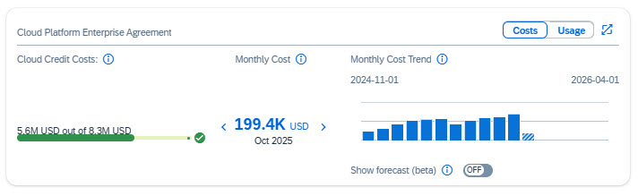

# Exercise 5 - Optimization

## Introduction

In this section, you will learn to identify and implement cost and utilization optimizations for your overall global account. By analyzing trends in cloud credits, prepaid quotas, and consumption patterns, you can make informed decisions to control costs and maximize the value of your SAP BTP investments.

This exercise focuses on **strategic, account-level optimizations** rather than service-specific optimizations, as recommendations for individual services vary based on their unique characteristics and usage patterns.

The two key optimization strategies covered in this exercise are:
1. **Cloud Credit Management**: Forecasting and planning to avoid costly overages
2. **Subscription vs. Consumption Balance**: Optimizing the mix of prepaid quotas and consumption-based usage

By the end of this exercise, you'll be able to proactively manage your BTP spending and make strategic purchasing decisions.

## Scenario 1 - Optimizing Cloud Credit Costs

In this scenario, you will learn how to use Cloud Credit forecasting to anticipate potential overages and plan your purchasing strategy accordingly.

### Understanding Your Cloud Credit Status

1. In the Costs and Usage page, locate the **Cloud Platform Enterprise Agreement** card in the header (the card on the right).
2. Review the current cloud credits cost to see if you have exceeded or are approaching the limit.
3. Switch on the **"Show Forecast"** control to enable predictive analysis.

> [!TIP]
> The forecast uses historical consumption patterns and current trends to predict future cloud credit usage throughout your contract period.

4. Expand the card by clicking the expand icon to view the detailed monthly trend graph.
5. Review the forecasted monthly trend and identify when costs are projected to exceed your cloud credit allocation.

   **When does the forecast predict cost overage?**

   

   
Answer

   **February**

   The forecast predicts that cloud credit overage will occur in February, approximately 3-4 months from now. This early warning provides valuable lead time to take proactive action, such as purchasing additional cloud credits at discounted rates or implementing cost optimization measures to avoid expensive list-price overage charges.
   

    

### Taking Action Based on Forecast Results

Based on the forecast results showing a potential overage in February, you have several optimization options:

- **Contact SAP to purchase additional cloud credits**: By purchasing more cloud credits before the overage occurs, you can avoid significant charges at list price
- **Implement cost optimization initiatives**: Review high-cost services and subaccounts to reduce consumption
- **Reallocate resources**: Shift workloads or postpone non-critical projects to stay within your credit allocation

> [!NOTE]
> Cloud credits are typically purchased at a discounted rate compared to list prices. Proactively purchasing additional credits before an overage occurs can result in significant cost savings compared to paying list price for overage consumption.

### Benefits of Cloud Credits Forecasting

With Cloud Credits Forecasting, you can:

- **Identify trends** to anticipate overages or unused credits before they impact your budget
- **Optimize purchasing decisions** to control future costs and maximize your return on investment
- **Plan proactively** with insights that support better budget and resource management across your organization
- **Avoid surprises** by understanding your trajectory months in advance

## Scenario 2 - Optimizing Subscription and Consumption Commercial Models

In this scenario, you will learn how to manage and track both subscription and consumption commercial models for your BTP services to ensure you're using the most cost-effective approach.

### Understanding Your Prepaid Quota Utilization

1. In the Costs and Usage header, ensure that the Month filter is set to **the previous month**. This is the month where you identified an increase in overall global account costs in Exercise 2.
2. By default, you should see the Billing view → **View By Service** display.
3. Make sure **"Show only services with charged usage"** is **NOT checked** (unchecked).

> [!TIP]
> Keeping all services visible allows you to see both services within prepaid quota and those incurring additional charges, giving you a complete picture of your service portfolio.

4. Sort the **Prepaid Quota** column in **descending order** to see services with the highest quotas at the top.
5. You will notice several services that include a prepaid quota. This refers to the amount your global account is entitled to consume in advance from your subscription-based commercial model agreement. Any usage within this quota will not incur additional billing.

> [!NOTE]
> The Prepaid Quota represents capacity you've already purchased through a subscription. It's critical to maximize utilization of this quota before paying for additional consumption-based services.

6. Review the list and observe that most of these services (except one) have **Charged Usage** and **List Price** of 0, because their usage is lower than the prepaid quota. This means they are fully utilizing services covered by the subscription without incurring additional costs.
7. Select **Cloud Foundry Runtime - Standard**, which is the only service with both prepaid quota **and** a list price, indicating its usage has exceeded the prepaid quota.

### Analyzing Usage Trends

8. Scroll down to the graph and choose **View by: Total Usage** to see the prepaid quota dotted line in the graph over the last 12 months.
9. Analyze the trend over the last 12 months for Cloud Foundry Runtime:
   - The prepaid quota started at **40 GB**
   - Usage started at **30 GB** for the first 2 months, then increased to **40 GB**
   - Recognizing this increase, the Apex controller purchased an additional **20 GB** of Cloud Foundry Runtime subscription, increasing the quota to **60 GB**
   - After several more months, usage has increased to **80 GB**, creating a **20 GB overage** that is being charged at consumption rates

> [!TIP]
> The dotted line in the graph represents your prepaid quota. When the solid usage line exceeds the dotted line, you're paying additional consumption-based charges for the overage.

### Optimization Recommendation

   **How can you optimize the costs for Cloud Foundry Runtime?**

   

   
Answer

   **Purchase an additional 20 GB of prepaid quota subscription**

   By purchasing additional prepaid quota to cover the 20 GB overage, you can take advantage of subscription pricing (which is typically lower than consumption-based pricing) and reduce your overall costs. This approach is particularly cost-effective when the usage pattern is consistent and predictable.

   

    

### Strategic Considerations

When deciding between subscription (prepaid quota) and consumption models, consider:

- **Predictable workloads**: Use subscription for consistent, baseline usage
- **Variable workloads**: Keep consumption-based pricing for unpredictable spikes
- **Break-even analysis**: Calculate whether the subscription discount justifies the commitment
- **Future growth**: Forecast whether current overages represent temporary spikes or sustained growth

> [!NOTE]
> Contact your SAP account team to discuss purchasing additional prepaid quota. They can help you analyze your usage patterns and recommend the optimal subscription size for your needs.

## Summary

### 🎯 Key Takeaways

#### Cloud Credit Optimization
- ✅ Track and forecast cloud credit usage to identify potential overages
- ✅ Use "Show Forecast" feature to visualize projected spending
- ✅ Purchase additional cloud credits at discounted rates before overages
- ✅ Understand cost difference between prepaid credits and list-price overages

#### Subscription vs. Consumption Analysis
- ✅ Understand subscription (prepaid quota) vs. consumption-based models
- ✅ Identify prepaid quota utilization to maximize existing investments
- ✅ Analyze 12-month usage trends to distinguish baseline from growth
- ✅ Identify services exceeding prepaid quotas and incurring consumption charges

#### Strategic Cost Optimization
- ✅ Make data-driven decisions about purchasing additional subscriptions
- ✅ Balance subscription commitments with consumption flexibility
- ✅ Apply break-even analysis for subscription vs. consumption decisions
- ✅ Recognize optimization as ongoing process requiring monthly reviews

> [!TIP]
> Optimization is an ongoing process. Review your cloud credits and prepaid quota utilization monthly to catch trends early and make timely adjustments to your purchasing strategy.

---

[← Previous: Exercise 2 - Monitoring cost and consumption](02-monitoring-costs.md) | [Continue to: Exercise 4 - Controlling Costs Using Budgets →](04-budgets.md)
