# Complete Guide to GitHub Markdown Features (2024-2025)

> [!NOTE]
> This guide covers all current GitHub markdown features including recent additions for creating visually rich documentation.
>
> **Updated with real-world nuances:** Includes critical findings about indentation issues, copy buttons, and spacing that affect rendering on GitHub.

---

## 🎯 Summary of Available Features

### ✅ Fully Supported on GitHub

| Feature | Since | Description | Usage |
|---------|-------|-------------|-------|
| **Alerts/Callouts** | 2023 | Colored note boxes | `> [!NOTE]`, `> [!TIP]`, etc. |
| **Mermaid Diagrams** | 2022 | Flowcharts, sequences, etc. | ` ```mermaid` |
| **Math/LaTeX** | 2022 | Mathematical expressions | `$` inline, `$$` block |
| **GeoJSON Maps** | 2022 | Interactive maps | ` ```geojson` |
| **TopoJSON Maps** | 2022 | Topology maps | ` ```topojson` |
| **STL 3D Models** | 2022 | 3D model viewer | ` ```stl` |
| **Footnotes** | 2021 | Reference notes | `[^1]` |
| **Task Lists** | 2014 | Interactive checkboxes | `- [ ]` |
| **Collapsible Sections** | Always | Hide/show content | `<details>` |
| **Tables** | Always | Data grids | `\| col \|` |
| **Video Embeds** | 2023 | MP4, WebM support | Drag & drop or link |
| **Code Blocks** | Always | Copy buttons automatic | ` ```code``` ` |
| **HTML Breaks** | Always | Extra spacing | `<br>` |

### ⚠️ Critical Gotchas & Nuances

| Issue | Problem | Solution | Section |
|-------|---------|----------|---------|
| **Indented `<details>`** | Renders as plain text | Start at column 0 or use alerts | 🔟 Collapsible Sections |
| **Inline code copying** | No copy button | Use fenced code blocks instead | 1️⃣1️⃣ Code Blocks |
| **Multiple blank lines** | Collapse to single space | Use `<br>` tags | 1️⃣2️⃣ Spacing |
| **Preview vs. actual** | May render differently | Always test on GitHub.com | Throughout |

---

## 1️⃣ Alert/Callout Boxes (Great for Q&A!)

### Available Types

```markdown
> [!NOTE]
> Useful information that users should know (blue)

> [!TIP]
> Helpful advice for doing things better (green)

> [!IMPORTANT]
> Key information users need to know (purple)

> [!WARNING]
> Urgent info that needs immediate attention (yellow)

> [!CAUTION]
> Advises about risks or negative outcomes (red)
```

### Rendered Examples:

> [!NOTE]
> This is how a NOTE appears - great for answers and information

> [!TIP]
> This is how a TIP appears - perfect for questions to explore

> [!IMPORTANT]
> This is how IMPORTANT appears - ideal for key findings

> [!WARNING]
> This is how WARNING appears - good for scenarios

> [!CAUTION]
> This is how CAUTION appears - for critical issues

---

## 2️⃣ Mermaid Diagrams

### Flowchart Example


### Sequence Diagram Example


### Pie Chart Example


### Gantt Chart Example


---

## 3️⃣ Mathematical Expressions (LaTeX)

### Inline Math
Use single dollar signs: $E = mc^2$ or $`x = {-b \pm \sqrt{b^2-4ac} \over 2a}`$

### Block Math

$$
\begin{aligned}
\text{Total Cost} &= \sum_{i=1}^{n} \text{Service}_i \times \text{Usage}_i \\
&= €18,000 + €12,000 + €8,000 + €4,500 + €2,500 \\
&= €45,000
\end{aligned}
$$

### Cost Optimization Formula

```math
\text{Savings} = \left(\text{Current}_{\text{cost}} - \text{Optimized}_{\text{cost}}\right) \times 12 \text{ months}
```

---

## 4️⃣ Interactive Maps (GeoJSON)

```geojson
{
  "type": "FeatureCollection",
  "features": [
    {
      "type": "Feature",
      "properties": {
        "name": "New York Data Center",
        "cost": "$20M/year"
      },
      "geometry": {
        "type": "Point",
        "coordinates": [-74.006, 40.7128]
      }
    },
    {
      "type": "Feature",
      "properties": {
        "name": "London Data Center",
        "cost": "$15M/year"
      },
      "geometry": {
        "type": "Point",
        "coordinates": [-0.1276, 51.5074]
      }
    },
    {
      "type": "Feature",
      "properties": {
        "name": "Singapore Data Center",
        "cost": "$15M/year"
      },
      "geometry": {
        "type": "Point",
        "coordinates": [103.8198, 1.3521]
      }
    }
  ]
}
```

---

## 5️⃣ 3D Models (STL ASCII)

```stl
solid cube
  facet normal 0 0 0
    outer loop
      vertex 0 0 0
      vertex 1 0 0
      vertex 1 1 0
    endloop
  endfacet
  facet normal 0 0 0
    outer loop
      vertex 0 0 0
      vertex 0 1 0
      vertex 1 1 0
    endloop
  endfacet
endsolid cube
```

*Note: Binary STL files must be converted to ASCII format*

---

## 6️⃣ Footnotes

Here's some text with a footnote[^1] and another one[^2].

You can also use named footnotes[^note] for better clarity.

[^1]: This is the first footnote that appears at the bottom.
[^2]: This is the second footnote with more detail.
[^note]: Named footnotes are easier to track in long documents.

---

## 7️⃣ Video Embeds

### Direct Upload
Simply drag and drop `.mp4`, `.mov`, `.webm`, or `.ogv` files into your markdown file!

### From URL
```markdown

```

### YouTube (via HTML - some contexts)
```html
<a href="https://www.youtube.com/watch?v=VIDEO_ID">
  
</a>
```

---

## 8️⃣ Enhanced Tables

### Basic Table
| Feature | Support | Visual Impact |
|---------|---------|---------------|
| Headers | ✅ Yes | High |
| Alignment | ✅ Yes | Medium |
| Spans | ❌ No | - |
| Colors | ❌ No | - |

### Alignment Options
| Left | Center | Right |
|:-----|:------:|------:|
| Text | Text | Text |
| 123 | 456 | 789 |

---

## 9️⃣ Task Lists with Progress

### Project Checklist
- [x] Verify invoice accuracy
- [x] Analyze cost drivers
- [ ] Implement quick wins
- [ ] Deploy monitoring
- [ ] Create dashboards

### Nested Tasks
- [x] **Phase 1: Analysis**
  - [x] Download usage reports
  - [x] Compare with invoice
  - [x] Document findings
- [ ] **Phase 2: Optimization**
  - [ ] Shutdown unused resources
  - [ ] Right-size instances
  - [ ] Implement auto-scaling

---

## 🔟 Collapsible Sections (Details/Summary)

### Basic Syntax

```markdown
<details>
<summary><b>Click to expand</b></summary>

Your content here...

</details>
```

### ⚠️ Critical: Indentation Issues

**IMPORTANT:** Indentation can break collapsible sections!

#### ❌ Broken (Will Render as Plain Text)
```markdown
8. Some list item

   <details>
   <summary><b>What are labels?</b></summary>

   Content here

   </details>
```

**Why it breaks:** GitHub's markdown parser may not recognize indented `<details>` tags as HTML.

#### ✅ Working Options

**Option 1: No Indentation (Functional but not visually aligned)**
```markdown
8. Some list item

<details>
<summary><b>What are labels?</b></summary>

Content here

</details>
```

**Option 2: Use Alerts Instead (Better for lists)**
```markdown
8. Some list item

   > [!NOTE]
   > **What are labels?**
   > Content here - alerts work fine when indented!
```

**Option 3: Separate from List**
```markdown
8. Some list item

---

<details>
<summary><b>What are labels?</b></summary>

Content here

</details>

---

9. Next list item
```

### Working Examples

<details>
<summary><b>📊 Click to see cost breakdown</b></summary>

### Detailed Cost Analysis

| Service | Q3 2024 | Q4 2024 | Change |
|---------|---------|---------|--------|
| HANA Cloud | €15,000 | €18,000 | +20% |
| Cloud Foundry | €10,000 | €12,000 | +20% |
| Integration | €5,500 | €8,000 | +45% |

> [!TIP]
> You can nest alerts inside collapsible sections!

</details>

<details>
<summary><b>🎯 Implementation Steps</b></summary>

1. **Week 1-2**: Quick Wins
   - [ ] Shutdown dev environments
   - [ ] Delete orphaned resources

2. **Week 3-4**: Monitoring
   - [ ] Deploy dashboards
   - [ ] Set up alerts

</details>

### Best Practices

1. **Start tags at column 0** (no indentation) for guaranteed rendering
2. **Use alerts for indented content** - they handle indentation better
3. **Add blank lines** before and after `<details>` blocks
4. **Test rendering** on GitHub - preview may differ from actual rendering
5. **Prefer `<b>` over `**bold**`** in summary tags for consistency

---

## 1️⃣1️⃣ Code Blocks & Copy Buttons

### Inline vs. Block Code

GitHub automatically provides **copy buttons** on fenced code blocks, but NOT on inline code.

#### Inline Code (No Copy Button)
```markdown
Use `inline code` for short snippets in text flow.
```
Renders as: Use `inline code` for short snippets in text flow.

**When to use:**
- Variable names, file paths, short commands within sentences
- When visual distinction is needed but copying is not critical

#### Fenced Code Blocks (Copy Button Included!)
````markdown
```
Text in a code block - has copy button!
```
````

**When to use:**
- URLs, credentials, email addresses users need to copy
- Multi-line code snippets
- Any value users will copy-paste

### ✅ Best Practice: Copyable Values

**❌ Don't use inline code for values to copy:**
```markdown
Enter the URL `https://very-long-url.com/with/many/parameters`
```

**✅ Do use code blocks for copyable values:**
```markdown
Enter the URL:
```
https://very-long-url.com/with/many/parameters
```
```

### Real-World Example

**Workshop Instructions Format:**

````markdown
1. Open the application
   ```
   https://emea.cockpit.btp.cloud.sap/cockpit/?idp=example.com
   ```

2. Enter your username (replace XXX with your number):
   ```
   XP263-XXX@education.cloud.sap
   ```
   For example:
   ```
   XP263-000@education.cloud.sap
   ```

3. Enter the password:
   ```
   SecurePassword123!
   ```
````

### Copy Button Availability

| Context | Copy Button | Notes |
|---------|-------------|-------|
| GitHub.com (web) | ✅ Yes | Appears on hover (top-right corner) |
| GitHub README | ✅ Yes | Same as web view |
| VS Code preview | ⚠️ Maybe | Depends on markdown extension |
| Raw markdown | ❌ No | Not rendered |
| GitHub mobile app | ✅ Yes | Tap to copy |

### Tips

1. **Hover test:** Copy buttons appear when hovering over code blocks on GitHub
2. **Use blank code blocks** when you don't need syntax highlighting
3. **Language tags optional:** ` ```bash` vs ` ``` ` - both have copy buttons
4. **Indentation works:** Code blocks can be indented (unlike `<details>`)

---

## 1️⃣2️⃣ Spacing & Line Breaks

### The Problem: Multiple Blank Lines Collapse

Markdown collapses multiple consecutive blank lines into a single space when rendered.

#### ❌ Doesn't Create Extra Space
```markdown
Some text


More text (only 1 line gap will show)
```

#### ✅ Use HTML Break Tags
```markdown
Some text

<br>

More text (now has visual spacing!)
```

### When to Use `<br>` Tags

**Use case 1: Separating sections within lists**
```markdown
8. First item with details

<details>
<summary>More info</summary>
Content here
</details>

<br>

9. Next item (has visual space from previous)
```

**Use case 2: Creating breathing room in dense content**
```markdown
> [!NOTE]
> Important information here

<br>

Next paragraph needs separation
```

**Use case 3: Between different element types**
```markdown
Regular paragraph

<br>

| Table | Header |
|-------|--------|
| Data  | Here   |
```

### Alternative: Horizontal Rules

For stronger visual separation, use `---`:

```markdown
Section 1 content

---

Section 2 content
```

### Spacing Best Practices

| Situation | Solution | Visual Impact |
|-----------|----------|---------------|
| Between paragraphs | 1 blank line | Standard |
| Before/after code blocks | 1 blank line | Standard |
| Before/after lists | 1 blank line | Standard |
| Extra breathing room | `<br>` tag | Medium |
| Section separation | `---` rule | Strong |
| Major section break | `---` + blank lines | Very strong |

### Common Patterns

**Pattern 1: List item with collapsible**
```markdown
8. Item text

<details>
<summary>Details</summary>
Content
</details>

<br>

9. Next item
```

**Pattern 2: Alert with follow-up**
```markdown
> [!WARNING]
> Critical information

<br>

Continue with normal text after visual break
```

**Pattern 3: Code block series**
```markdown
Step 1:
```
command-one
```

<br>

Step 2:
```
command-two
```
```

---

## 🎨 Combining Features for Maximum Impact

### Example: Cost Analysis Dashboard

> [!IMPORTANT]
> **Q4 2024 Cost Analysis Dashboard**

<details>
<summary><b>📊 View Detailed Metrics</b></summary>

#### Cost Distribution

```mermaid
pie title Service Costs (€45,000 total)
    "HANA Cloud" : 18000
    "Cloud Foundry" : 12000
    "Integration Suite" : 8000
    "AI Services" : 4500
    "Storage" : 2500
```


#### Monthly Trend
| Month | Cost | Δ |
|-------|------|---|
| Aug | €30,000 | - |
| Sep | €34,615 | +15% |
| Oct | €45,000 | +30% |

#### Cost Formula
$$\text{ROI} = \frac{\text{Savings} - \text{Investment}}{\text{Investment}} \times 100\%$$

</details>

> [!TIP]
> **Next Steps**
> - Review the cost breakdown above[^cost]
> - Implement quick wins for immediate savings
> - Schedule follow-up review

[^cost]: Based on October 2024 SAP BTP invoice

---

## 🚫 What Doesn't Work on GitHub

### Not Supported
- ❌ Inline CSS styles (`style="color:red"`)
- ❌ Custom HTML layouts (divs with styling)
- ❌ Font colors or custom fonts
- ❌ Background colors (except in alerts)
- ❌ Flexbox/Grid layouts
- ❌ JavaScript or interactive elements
- ❌ iframes (except in wikis with limitations)
- ❌ Audio embeds
- ❌ Custom emoji beyond standard set

### Limited Support
- ⚠️ HTML is sanitized (many tags removed)
- ⚠️ Some Mermaid features may not render
- ⚠️ Large files may not preview
- ⚠️ Complex math may have issues

---

## 💡 Best Practices for Visual Impact

### 1. Layer Your Features
Combine alerts + tables + collapsible sections for rich content

### 2. Use Emoji Strategically
- 📊 for data/metrics
- 🎯 for goals/objectives
- ⚡ for quick actions
- 💡 for tips/insights
- ⚠️ for warnings

### 3. Structure with Headers
Use consistent header levels with emoji prefixes

### 4. Create Visual Hierarchy
1. **Alerts** for important callouts
2. **Tables** for structured data
3. **Mermaid** for processes/flows
4. **Details** for optional content

### 5. Interactive Elements
- Task lists for progress tracking
- Collapsible sections to reduce clutter
- Footnotes for references
- Links for navigation

---

## 📚 Complete Feature Reference

| Category | Feature | Syntax | Best For |
|----------|---------|--------|----------|
| **Structure** | Headers | `#` to `######` | Document organization |
| **Emphasis** | Bold/Italic | `**bold**` `*italic*` | Text emphasis |
| **Lists** | Bullets/Numbers | `- item` `1. item` | Enumerations |
| **Links** | Hyperlinks | `[text](url)` | Navigation |
| **Images** | Images | `` | Visual content |
| **Code** | Inline | `` `code` `` | Short snippets (no copy button) |
| **Code** | Fenced Block | ` ```lang` | Multi-line code (has copy button!) |
| **Tables** | Tables | `\| col \|` | Data presentation |
| **Quotes** | Blockquotes | `> quote` | Emphasis |
| **Rules** | Horizontal | `---` | Separation |
| **Spacing** | Line Break | `<br>` | Extra vertical space |
| **Tasks** | Checkboxes | `- [ ]` | Progress tracking |
| **Alerts** | Callouts | `> [!TYPE]` | Important notes (indents well!) |
| **Diagrams** | Mermaid | ` ```mermaid` | Flowcharts |
| **Math** | LaTeX | `$math$` | Formulas |
| **Maps** | GeoJSON | ` ```geojson` | Geographic data |
| **3D** | STL | ` ```stl` | 3D models |
| **Collapse** | Details | `<details>` | Hide/show (no indent!) |
| **Footnotes** | References | `[^1]` | Citations |
| **Videos** | Embed | Drag/drop or URL | Demonstrations |

---

## 📝 Quick Reference: Common Issues & Solutions

| If you need to... | Don't use... | Use instead... |
|-------------------|--------------|----------------|
| Make text copyable | Inline `code` | Fenced code block |
| Add collapsible in list | Indented `<details>` | Unindented `<details>` or alert |
| Create extra spacing | Multiple blank lines | `<br>` tag |
| Visual separation | Nothing | `---` horizontal rule |
| Highlight important info | Bold text | Alert boxes (`> [!NOTE]`) |

---

*This guide represents the current state of GitHub Markdown as of 2024-2025. Features may be added or modified over time.*

*Last updated: Based on real-world TechEd 2025 workshop development - includes tested solutions for common rendering issues.*