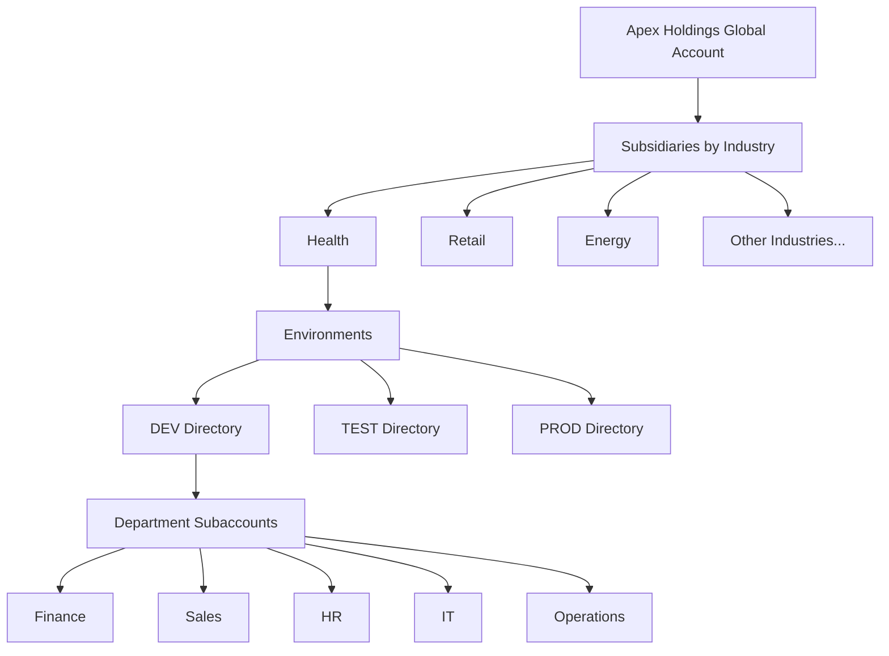
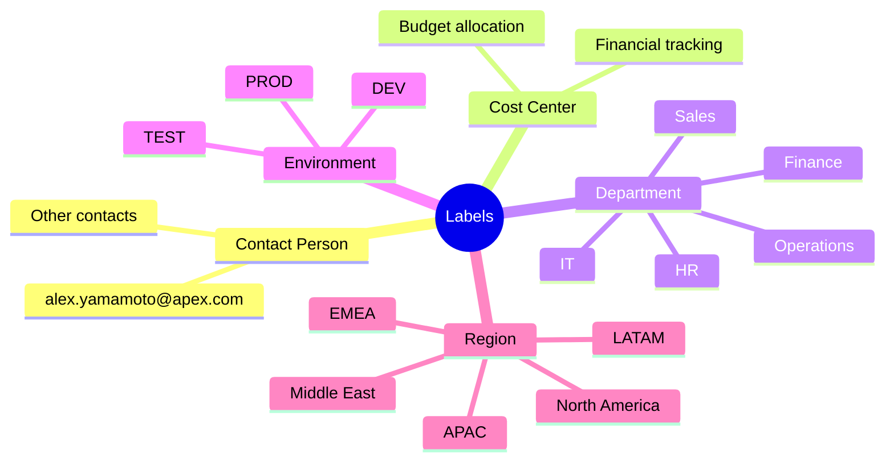

# TechEd - Apex Holdings Scenario

> [!NOTE]
> This guided exercise demonstrates SAP BTP administration and FinOps practices using a realistic enterprise simulation, for TechEd demo.

---

## 🏢 Overview

In this guided exercise, participants will take on the roles of **Apex Holdings administrators** and a **FinOps controller**.

Apex Holdings is a sample global enterprise created to simulate SAP BTP administration and FinOps practices. The company operates across diverse industries - such as health, retail, energy, etc. - each represented as Subsidiary with its own BTP directory.

Within each Subsidiary, you'll find departments such as **finance, sales, HR, IT, and operations** with subaccounts spanning regions like **EMEA, North America, APAC, LATAM, and the Middle East** (represented as labels).

Each Subsidiary manages its own dedicated applications, ranging from **payroll and performance reviews in HR** to **revenue forecasting, logistics, and customer insights**.

The overall account structure mirrors a real-world organization with **production, test, and development environments** (represented as directories) aligned to **cost centers and contact persons** (represented as labels).

### 🏗️ Account Structure Overview

### 📋 Key Organizational Elements

| Element | Representation | Examples |
|---------|----------------|----------|
| **Subsidiaries** | Directories | Health, Retail, Energy, etc. |
| **Environments** | Directories | DEV, TEST, PROD |
| **Departments** | Subaccounts | Finance, Sales, HR, IT, Operations |
| **Regions** | Labels | EMEA, North America, APAC, LATAM, Middle East |
| **Cost Centers** | Labels | Aligned to account structure |
| **Contact Persons** | Labels | e.g., alex.yamamoto@apex.com |

### 📱 Sample Applications by Department

<b>Click to view application examples from the scenario</b>

#### Human Resources
- Payroll applications
- Performance review systems

#### Finance
- Revenue forecasting tools

#### Operations
- Logistics management systems
- Customer insights platforms

*Note: These represent the types of applications managed within each Subsidiary's departments.*

---

## ⚠️ Important Disclaimers

> [!WARNING]
> **Planning Status**
> 
> *This is the current state of planning and may be changed by SAP at any time.*

> [!CAUTION]
> **Mock Data Notice**
> 
> Please note: The data used in this exercise is mock data created specifically for TechEd. All costs and names shown are for demonstration purposes only and should be disregarded.

---

## 🚀 Getting Started

> [!NOTE]
> **Prerequisites**
> 
> You have been granted with **Global Account Administrator** role collection.

### 📋 Step-by-Step Instructions

#### Step 1: Navigate to Account Explorer
In the BTP Cockpit, under the left page → navigate to the **Account Explorer**

#### Step 2: Review Account Structure
Review the account structure including **Subsidiaries**, represented as directories

#### Step 3: Explore Environment Directories
Under each Subsidiary, you will see the **DEV, TEST and PROD** environments represented as directories

#### Step 4: View Department Subaccounts
Under each environment folder, you will see the dedicated applications represented as subaccounts

#### Step 5: Understand the Label System

Each subaccount has **5 Labels** representing:

| Label | Purpose |
|-------|---------|
| **Contact Person** | Identifies the responsible individual |
| **Cost Center** | Enables cost allocation and tracking |
| **Department** | Organizational categorization |
| **Environment** | DEV, TEST, or PROD designation |
| **Region** | Geographic location |

> [!TIP]
> **What are Labels?**
> 
> Labels are user-defined words or phrases that you can assign to various entities (such as directories, subaccounts) in SAP BTP to categorize them in your global account, to identify them more easily.

**Labels enable you to:**
- Organize and filter entities within your global account
- Assist in managing the account and cost aggregation
- Particularly useful for accounts that lack a well-defined structure (e.g., those built-up layer by layer over time)

#### Step 6: Try Label Filtering

Try it out by entering **ContactPerson** in the search box and choose `"ContactPerson :alex.yamamoto@apex.com"`.

**Expected Result:** You will see a filtered list of the account structure including the subaccounts with label: `"ContactPerson :alex.yamamoto@apex.com"`

---

## 🎯 Exercise Goals

### What You Will Learn

- [ ] Navigate the BTP Account Explorer
- [ ] Understand the hierarchical structure (Subsidiaries → Environments → Subaccounts)
- [ ] Use Labels for filtering and organization
- [ ] Explore how cost centers and contact persons are tracked
- [ ] Practice filtering by different label types
- [ ] Preview the Cost and Usage Overview page

### Exercise Outcome

> [!IMPORTANT]
> The exercise demonstrates the capabilities available to all customers. At the end, you will explore a preview of the **Cost and Usage Overview page** (currently in a non-productive state).

---

## 📊 Understanding the Label System

### Why Labels Matter for FinOps

Labels provide the foundation for:

- **Cost Aggregation** - Group costs by department, region, or environment
- **Accountability** - Track ownership through contact person labels
- **Filtering** - Quickly find resources across complex structures
- **Reporting** - Generate views by any label dimension

### Label Types in This Exercise

### Practical Use Cases

<b>Example: Finding all resources owned by a specific person</b>

**Scenario:** You need to review all BTP resources managed by Alex Yamamoto

**Steps:**
1. Navigate to Account Explorer
2. Enter "ContactPerson" in the search box
3. Select `"ContactPerson :alex.yamamoto@apex.com"`
4. View filtered results showing all subaccounts assigned to Alex

<b>Example: Reviewing costs by department</b>

**Scenario:** Finance wants to see all HR department costs

**Steps:**
1. Use the Department label filter
2. Select "HR"
3. View all HR subaccounts across all environments and regions
4. Review associated costs in the Cost and Usage Overview

<b>Example: Managing non-production environments</b>

**Scenario:** You want to review all DEV environments for potential shutdown during off-hours

**Steps:**
1. Filter by Environment label
2. Select "DEV"
3. View all development subaccounts across subsidiaries
4. Implement shutdown policies for cost optimization

---

## 🌍 Regional Organization

The subaccounts span **five geographic regions**:

| Region | Coverage |
|--------|----------|
| **EMEA** | Europe, Middle East, and Africa |
| **North America** | United States, Canada, Mexico |
| **APAC** | Asia-Pacific region |
| **LATAM** | Latin America |
| **Middle East** | Middle Eastern countries |

*These regional labels enable geographic cost tracking and resource management.*

---

## 💡 Tips for Exploring the Scenario

> [!TIP]
> **Start with Overview, Then Dive Deep**
> 
> Begin by exploring the full account structure to understand the organization, then use filters to focus on specific areas of interest.

> [!TIP]
> **Experiment with Different Filters**
> 
> Try filtering by different label types to see how the same resources can be viewed from multiple perspectives (by owner, by department, by region, etc.).

> [!TIP]
> **Note the Structure Pattern**
> 
> Observe how the pattern of Subsidiary → Environment → Department creates clear separation and organization that mirrors real-world enterprise needs.

---

## 📚 Additional Context

### Why This Structure Matters

This account structure demonstrates **FinOps best practices** by:

- **Clear Ownership** - Contact person labels establish accountability
- **Cost Visibility** - Cost center labels enable financial tracking
- **Environment Separation** - DEV/TEST/PROD isolation supports lifecycle management
- **Organizational Alignment** - Department labels match business structure
- **Geographic Tracking** - Regional labels support distributed operations

### Real-World Application

While Apex Holdings is a simulation, this structure represents how enterprises can organize their SAP BTP accounts to support:

- Multi-industry operations
- Global deployments
- Clear cost attribution
- Governance and compliance
- Scalable growth

---

*The exercise demonstrates the capabilities available to all customers. At the end, you will explore a preview of the Cost and Usage Overview page (currently in a non-productive state).*
