# Exercise 1 - Billing Verification 🎯

> [!NOTE]
> **Your Role Today**: You are Jordan Chen, a FinOps Analyst at Apex Holdings, a multinational holding company with multiple subsidiaries. The CFO has asked you to verify the October 2025 billing statement against the BTP Cockpit data after noticing unexpected cost growth trends. Your analysis will inform the Q4 budget review meeting next week.

---

## 📊 Exercise Overview

**Mission**: Verify the accuracy of your October 2025 SAP BTP balance statement by cross-checking it against the BTP Cockpit data, then analyze cost trends to identify areas requiring investigation.

**Time Required**: 20-30 minutes
**Difficulty**: Beginner to Intermediate
**Prerequisites**: Access to SAP BTP Cockpit and October 2025 Balance Statement

### What You'll Learn

By the end of this exercise, you will be able to:

- ✅ Navigate the BTP Cockpit Costs and Usage interface efficiently
- ✅ Compare balance statement data with BTP Cockpit information systematically
- ✅ Verify service costs across different billing sections
- ✅ Calculate and validate cloud credit balances
- ✅ Analyze cost trends and identify anomalies
- ✅ Communicate billing verification findings to stakeholders

### The Apex Holdings Context

Apex Holdings recently expanded its SAP BTP footprint after acquiring two new subsidiaries. The company operates under a **Cloud Platform Enterprise Agreement (CPEA)** with:

- **$8.3M** in cloud credits for the current period
- Multiple subaccounts across different business units
- Both consumption-based and subscription-based services
- A recent cost reduction initiative that showed initial success

However, the CFO noticed that costs have been trending upward again over the past few months. Your job is to verify the billing accuracy and identify what's driving the growth.

---

## 📚 Understanding the Billing View

The balance statement (available in SAP for Me) is the starting point for cross-checking your BTP cost information. Monthly verification is recommended once the balance statement has been generated.

You can use the Billing view to display, monitor, and analyze your monthly charges of billable services consumed by the subaccounts in your global account over the last 12 months. The Billing view is split into two perspectives:

| View Type | Best For | What It Shows |
|-----------|----------|---------------|
| **View by Service** | 💰 Billing Verification | All services ordered as in the balance statement to enable analysis of service costs and usage |
| **View by Account** | 🏢 Cross Charging | Account hierarchy including subaccounts and directories to enable analysis of account entity costs and usage |

> [!TIP]
> **For this exercise**: We'll use **View by Service** since it directly maps to the balance statement structure, making verification more straightforward.

### The Verification Workflow

```mermaid
sequenceDiagram
    participant BS as 📄 Balance Statement<br/>(SAP for Me)
    participant You as 👤 You<br/>(FinOps Analyst)
    participant BTP as 💻 BTP Cockpit<br/>(Costs & Usage)
    participant CFO as 👔 CFO<br/>(Stakeholder)

    BS->>You: Download October statement
    Note over You: Review sections:<br/>- Total Consumption<br/>- CPEA Services<br/>- Cloud Credits
    You->>BTP: Navigate to Costs & Usage
    BTP->>You: Display service costs
    You->>You: Compare line by line
    alt All charges match
        You->>CFO: ✅ Verified - All accurate
    else Discrepancies found
        You->>BTP: Investigate details
        BTP->>You: Drill-down data
        You->>CFO: 🔍 Report findings
    end
```

<div align="center">



</div>

---

## 📍 Part 1: Orientation

**Objective**: Navigate to the Costs and Usage section and understand your account's billing structure.


### Navigation Steps

- [ ] In the BTP Cockpit, under the left pane navigate to the last page → **Costs and Usage**
- [ ] In the header, inside the **Global Account Info** card (card on the left), click on the link "Important information about your billing and usage data"
- [ ] Review that your global account is licensed for both the consumption-based and subscription-based commercial models
- [ ] In the header, locate the **Cloud Platform Enterprise Agreement** card (card on the right) presenting the Cloud Credits costs, status and trend
- [ ] In the Costs and Usage header, set the **Month filter** to **October 2025** (previous month)

> [!IMPORTANT]
> **Hybrid Billing Model**: Apex Holdings' account uses a hybrid model where prepaid quota from your subscription is utilized first, after which any excess usage is charged under the consumption-based model.

<details>
<summary>📖 <b>Understanding Commercial Models</b></summary>

### Consumption-Based Model 💳

**How it works**: Pay only for what you use, billed monthly based on actual service consumption.

**Advantages**:
- No upfront commitment
- Scales with actual usage
- Easy to start/stop services

**Best for**: Variable workloads, proof-of-concepts, development environments

### Subscription-Based Model 📅

**How it works**: Prepaid quota allocated upfront for a committed period (typically annual).

**Advantages**:
- Predictable costs
- Often includes volume discounts
- Guaranteed capacity

**Best for**: Stable, predictable production workloads

### Hybrid Model (Your Account) 🔄

**How it works**: Combines both models—subscription quota is consumed first, then overages are charged at consumption rates.

**Why Apex uses this**:
- Provides cost predictability for baseline usage
- Flexibility for growth and new projects
- Optimizes total cost of ownership

**Formula**:
$$
\text{Total Cost} = \text{Subscription Fee} + \max(0, \text{Usage} - \text{Prepaid Quota}) \times \text{Consumption Rate}
$$

</details>

<details>
<summary>💡 <b>Pro Tips: Navigating BTP Cockpit Efficiently</b></summary>

### Keyboard Shortcuts
- **Ctrl/Cmd + K**: Quick navigation search
- **Ctrl/Cmd + F**: Find in page
- **ESC**: Close modals/dialogs

### Browser Tips
- Bookmark the Costs & Usage page for quick access
- Open balance statement in a separate window for side-by-side comparison
- Use browser zoom (Ctrl/Cmd + or -) for better readability of charts

### Data Export Options
- Click "Export" button to download data as CSV or Excel
- Useful for detailed analysis or sharing with stakeholders
- Historical data available for up to 12 months

</details>

### ⚠️ Common Mistakes at This Stage

> [!WARNING]
> **Common Mistake #1**: Forgetting to set the month filter to the correct period
>
> **Impact**: You'll be comparing current month estimates against a finalized balance statement, leading to confusion.
>
> **Solution**: Always verify the month filter matches your balance statement period (October 2025 for this exercise).

> [!WARNING]
> **Common Mistake #2**: Not understanding the difference between "Usage" and "Charged Usage"
>
> **Impact**: Misinterpreting which costs are covered by subscription vs. charged additionally.
>
> **Solution**: Review the information icon (ℹ️) tooltips next to each column header.

---

## 🔍 Part 2: Compare Balance Statement and BTP Cockpit

**Objective**: Systematically verify that all charges in your balance statement match the BTP Cockpit data.

> [!NOTE]
> For this exercise, we're using screenshots from the **October 2025** balance statement. The balance statement is organized into sections marked by blue headings.


### Initial Setup

- [ ] In the Costs and Usage, verify you are viewing **Billing view → View By Service** display
- [ ] Confirm the list is sorted according to the **Product (SKU)** as in the balance statement
- [ ] Note that this view includes both services with and without costs (see List Price column)
- [ ] Choose **"Show only services with charged usage"** to filter out services with $0 cost

> [!TIP]
> **Why filter?** The balance statement displays only services with costs. Filtering to "Show only services with charged usage" reduces visual clutter and makes comparison easier.

### Before You Start: Understanding the Data Flow

```mermaid
flowchart LR
    A[🔧 Service Usage<br/>Raw Consumption] --> B[📊 Usage Aggregation<br/>BTP Backend]
    B --> C[📄 Balance Statement<br/>Monthly Billing]
    B --> D[💻 BTP Cockpit<br/>Costs & Usage]
    C -.->|Should Match| D
    style C fill:#e1f5ff
    style D fill:#e1f5ff
```

<div align="center">



</div>

The same backend system feeds both the balance statement and BTP Cockpit, so they should always match. If they don't, it indicates either:
- A timing issue (data not yet synchronized)
- A filtering/display issue
- An actual billing discrepancy requiring investigation

---

### 💰 Section 2A: Total Consumption Services


**What are Total Consumption services?** These are services charged purely based on usage, without any prepaid quota applied. They appear in the first section of your balance statement.

**Verification Task**: Compare the first 3 services listed in the balance statement under section **'Total Consumption'** with the information in the Costs and Usage.

#### Verification Checklist

- [ ] **Step 1**: Locate the first service in the balance statement (note the Product/SKU name)
- [ ] **Step 2**: Find the matching service in BTP Cockpit (use Ctrl+F to search)
- [ ] **Step 3**: Compare the **Usage** column values
- [ ] **Step 4**: Compare the **Prepaid quota** column values (should be 0 for consumption services)
- [ ] **Step 5**: Compare the **Charged Usage** column values
- [ ] **Step 6**: Repeat for the next 2 services

<details>
<summary>❓ <b>Need help understanding these columns?</b></summary>

Click the information icon (ℹ️) on the Costs and Usage page for detailed explanations of:

| Column | Definition | What to Look For |
|--------|------------|------------------|
| **Usage** | Total service consumption for the period measured in service-specific units (e.g., GB-hours, API calls) | Should match "Quantity" in balance statement |
| **Prepaid quota** | Allocated subscription quota used for this service | Should be 0 for pure consumption services |
| **Charged Usage** | Consumption beyond prepaid quota that incurs charges | Should match "Charged Quantity" in balance statement |
| **List Price** | Total cost for this service at standard rates | Should match "Net Amount" in balance statement |

</details>

<details>
<summary>🧪 <b>Try It Yourself: Calculate Service Cost</b></summary>

### Challenge

Given the following data for a service:
- Usage: 1,000 GB-hours
- Prepaid quota: 250 GB-hours
- Rate: $0.50 per GB-hour

**Question**: What is the charged usage cost?

<details>
<summary><b>Click to reveal answer</b></summary>

**Calculation**:

$$
\text{Charged Usage} = \text{Usage} - \text{Prepaid Quota} = 1{,}000 - 250 = 750 \text{ GB-hours}
$$

$$
\text{Cost} = \text{Charged Usage} \times \text{Rate} = 750 \times \$0.50 = \$375
$$

**Answer**: $375

**Key Learning**: Only usage beyond the prepaid quota is charged. The prepaid quota is "free" since it was already paid for in your subscription.

</details>

</details>

> [!WARNING]
> **Common Mistake #3**: Not accounting for unit conversions
>
> **Example**: Balance statement shows "1,000 GB-hours" but BTP Cockpit shows "1 TB-hours"
>
> **Solution**: Verify the units! 1 TB = 1,000 GB, so these values are identical.

---

### 💳 Section 2B: Cloud Platform Enterprise Agreement Services


**What are CPEA services?** These are services covered under your Cloud Platform Enterprise Agreement, drawn against your cloud credits. They represent your committed subscription services.

**Verification Task**: Compare the first 3 services in the balance statement under section **'Cloud Platform Enterprise Agreement'** with the Costs and Usage page.

#### Verification Checklist

- [ ] **Step 1**: Locate the CPEA section in your balance statement (usually the second major section)
- [ ] **Step 2**: Identify the first 3 services listed
- [ ] **Step 3**: Find matching services in BTP Cockpit
- [ ] **Step 4**: Compare the **List Price** column values between both sources
- [ ] **Step 5**: Verify these services show prepaid quota usage (not $0)

> [!NOTE]
> **Key Insight**: The Costs and Usage page aggregates the balance statement sections into a single unified view. This enables you to see the information per service together and drill down into the details of each service to better understand how its costs were generated.

### Understanding the Unified View

```mermaid
flowchart TD
    BS[📄 Balance Statement]
    BS --> TC[Section 1:<br/>Total Consumption]
    BS --> CPEA[Section 2:<br/>CPEA Services]
    BS --> OTHER[Section 3:<br/>Other Charges]

    BTP[💻 BTP Cockpit<br/>Unified View]

    TC -.->|Merged| BTP
    CPEA -.->|Merged| BTP
    OTHER -.->|Merged| BTP

    BTP --> DETAIL[Click service for<br/>detailed breakdown]

    style BTP fill:#90EE90
    style DETAIL fill:#FFD700
```

<div align="center">



</div>

**Advantage**: Instead of jumping between sections, you see all costs for a service in one place—whether it's consumption-based, subscription-based, or a mix.

<details>
<summary>💡 <b>Pro Tip: Drill-Down Analysis</b></summary>

### How to Investigate Service Costs in Detail

1. **Click on any service name** in the Costs and Usage table
2. You'll see a detailed breakdown showing:
   - Subaccount-level consumption
   - Daily/weekly usage patterns
   - Service plan breakdowns
   - Metric-level details

3. **Use this when**:
   - Numbers don't immediately match
   - You need to understand which subaccount drove costs
   - You want to identify usage spikes
   - Preparing for stakeholder questions

4. **Example use case**: "HANA Cloud shows $18,000 this month—which subaccount is using it the most?"

</details>

---

### 🏦 Section 2C: Cloud Credits and Payment Summary


**Objective**: Verify your cloud credit calculation and confirm there are no unexpected payment obligations.

#### Understanding Apex Holdings' Cloud Credits

> [!IMPORTANT]
> **Apex Holdings Context**: As a holding company with multiple subsidiaries, Apex expanded its contract with the following cloud credit structure:

| Metric | Amount | Explanation |
|--------|--------|-------------|
| **Cloud credits for current period** | $8.3 M | Total prepaid credits available for the contract period (typically annual) |
| **Cloud credits used (balance)** | $5.6 M | Credits consumed from the start of the period through October 2025 |
| **Remaining cloud credits** | **$2.7 M** | Credits still available for use |

#### The Cloud Credits Formula

The remaining cloud credits calculation:

$$
\text{Remaining Credits} = \text{Period Credits} - \text{Used Credits}
$$

$$
\$2.7\text{M} = \$8.3\text{M} - \$5.6\text{M}
$$

**What this means**:
- Apex has consumed 67.5% of its annual cloud credits ($5.6M / $8.3M)
- There's still 32.5% remaining ($2.7M / $8.3M)
- If we're in October (month 10 of 12), we're using credits slightly faster than expected (should be ~83% through at this point)
- **Implication**: Cost management becomes critical for the remaining months

#### Verification Steps

- [ ] In the Costs and Usage header, expand the **Cloud Platform Enterprise Agreement** card (card on the right)
- [ ] Verify the card shows **$8.3 M** for the current period total
- [ ] Verify the balance shows **$5.6 M** used
- [ ] Confirm remaining cloud credits show **$2.7 M**
- [ ] Hover over the **October bar** in the trend chart to view October's cloud credit consumption
- [ ] Compare the remaining **$2.7 M** to the 'Closing Cloud Credit balance as of Oct 30, 2025' in the balance statement

> [!NOTE]
> **No Overages**: Since there are remaining cloud credits ($2.7M > $0), the balance statement shows a 'Net Overage Amount' of $0. This indicates there are no overages, and therefore you can see in the 'Payment Summary', no additional costs to be paid this month.

#### What If Scenarios

<details>
<summary>🤔 <b>What If: Cloud Credits Were Exhausted?</b></summary>

### Scenario: Running Out of Cloud Credits

**Situation**: Imagine Apex had used $8.5M instead of $5.6M, exhausting all $8.3M in cloud credits.

**What would happen**:

1. **Overage Calculation**:
$$
\text{Net Overage} = \text{Used Credits} - \text{Period Credits} = \$8.5\text{M} - \$8.3\text{M} = \$0.2\text{M}
$$

2. **Balance Statement Changes**:
   - "Closing Cloud Credit Balance" would show: **$0**
   - "Net Overage Amount" would show: **$200,000**
   - "Payment Summary" would include: **$200,000 due**

3. **BTP Cockpit Display**:
   - Cloud credits remaining: **$0**
   - Warning indicator likely displayed
   - Trend chart would show red/warning state

4. **Billing Impact**:
   - Additional invoice for $200,000
   - Future consumption billed at consumption rates until credit replenishment
   - Potential need for contract amendment or credit purchase

**Action Items**:
- Notify finance team immediately
- Review current month consumption trends
- Consider cost reduction measures
- Evaluate whether additional cloud credits purchase is needed

</details>

<details>
<summary>🤔 <b>What If: Balance Statement and BTP Cockpit Don't Match?</b></summary>

### Troubleshooting Discrepancies

#### Step 1: Check Data Freshness
- Balance statement date: ___________
- BTP Cockpit "Last Updated": ___________
- **Issue**: BTP Cockpit data might not be finalized yet

#### Step 2: Verify Time Period
- Balance statement period: ___________
- BTP Cockpit filter setting: ___________
- **Issue**: Different months being compared

#### Step 3: Check Filtering
- Balance statement filters: ___________
- BTP Cockpit "Show only services with charged usage": ☐
- **Issue**: Different services included

#### Step 4: Look for Adjustments
- Credits/adjustments in balance statement: ___________
- Special charges or discounts: ___________
- **Issue**: One-time items not yet reflected

#### Step 5: Escalate If Needed

If discrepancies remain after the above checks:


**Contact Information**:
- BTP Support: support.sap.com/btp
- Account Manager: [Contact your SAP account team]
- Internal Finance: [Your finance team contact]

</details>

---

### ✅ Verification Checkpoint #1

**Self-Assessment Question**: Did the billing verification confirm that all charges are accurate?

<details>
<summary><b>📝 Click to record your answer and rationale</b></summary>

### Your Answer

**Are all charges accurate?** ☐ Yes  ☐ No  ☐ Partially

**Rationale** (explain your answer):
```
[Space for your notes]

Example answers:
- "Yes - all service costs matched between balance statement and BTP Cockpit
  within $5 variance (likely rounding). Cloud credits calculation confirmed."

- "No - found $1,500 discrepancy in HANA Cloud service. Created support ticket #12345."

- "Partially - all services match except for one that shows different unit conversions.
  Need to investigate further."
```

**Confidence Level**: ⭐⭐⭐⭐⭐ (1=Low, 5=High)

**Follow-up Actions**:
```
[List any next steps needed]

Examples:
- None - verification complete
- Contact support about discrepancy in service X
- Review drill-down data for service Y
- Discuss findings with finance team
```

</details>

<details>
<summary>📋 <b>Verification Checklist Summary</b></summary>

| Verification Item | Expected Result | Actual Result | Status | Notes |
|------------------|-----------------|---------------|--------|-------|
| Total Consumption - Service 1 | $X,XXX | _______ | ☐ ✅ ☐ ❌ | |
| Total Consumption - Service 2 | $X,XXX | _______ | ☐ ✅ ☐ ❌ | |
| Total Consumption - Service 3 | $X,XXX | _______ | ☐ ✅ ☐ ❌ | |
| CPEA - Service 1 | $X,XXX | _______ | ☐ ✅ ☐ ❌ | |
| CPEA - Service 2 | $X,XXX | _______ | ☐ ✅ ☐ ❌ | |
| CPEA - Service 3 | $X,XXX | _______ | ☐ ✅ ☐ ❌ | |
| Cloud Credits - Period Total | $8.3M | _______ | ☐ ✅ ☐ ❌ | |
| Cloud Credits - Used | $5.6M | _______ | ☐ ✅ ☐ ❌ | |
| Cloud Credits - Remaining | $2.7M | _______ | ☐ ✅ ☐ ❌ | |
| Net Overage Amount | $0 | _______ | ☐ ✅ ☐ ❌ | |
| Payment Due | $0 | _______ | ☐ ✅ ☐ ❌ | |

**Overall Verification Status**: ☐ Pass  ☐ Fail  ☐ Needs Review

</details>

---

## 📈 Part 3: Analyze the Overall Global Account Cost Trend

**Objective**: Understand your cost trajectory over time and identify trends that require attention.

### View the Cost Trend Graph

- [ ] Scroll down to view the graph presenting the **Global Account - Cost Summary**
- [ ] Choose **View By: List Price**
- [ ] Review the cost trend for the last 12 months
- [ ] Note any significant spikes or drops

### Visualizing Cost Distribution

<div align="center">


</div>

> [!NOTE]
> The pie chart above is an example. Your actual distribution may vary. Use the BTP Cockpit to see your specific service breakdown.

### Monthly Trend Timeline

<div align="center">


</div>

**Observation**: Steady upward trend with approximately 3-5% month-over-month growth.

---

### Cost Trend Analysis

**Question**: Which month has the highest costs over the last 12 months?

<details>
<summary><b>📊 Click to record your answer and analysis</b></summary>

### Your Analysis

**Highest Cost Month**: _______________

**Cost Amount**: $_______________

**Year-over-Year Comparison** (if data available):
- Same month last year: $_______________
- Change: _______________% increase/decrease

**Seasonal Factors to Consider**:
```
[Your observations]

Examples:
- October may be higher due to year-end project completion
- Increased development activity in Q4
- New service launches in October
- Subsidiary acquisitions increasing overall usage
```

**Services Contributing Most to This Peak**:
1. _______________ ($________)
2. _______________ ($________)
3. _______________ ($________)

</details>

### Understanding Estimated vs. Actual Costs

- [ ] Hover over the bars to see the estimated costs in **November** (current month)
- [ ] Note the visual difference (striped bars) indicating estimates

> [!IMPORTANT]
> **Understanding Estimated Costs**: In November (current month), the estimated costs are displayed as **striped bars**. These values cover the period between the last balance statement and today.
>
> **Key Characteristics of Estimates**:
>
> | Aspect | Details |
> |--------|---------|
> | **Data Source** | Raw resource usage data before final aggregation for billing |
> | **Update Frequency** | Typically updated daily or weekly |
> | **Accuracy** | May change once the billing cycle closes and balance statement is issued |
> | **What They Are** | Actual usage to date, **NOT** forecast values |
> | **What They're NOT** | Projected future usage for the remainder of the month |
>
> **Example**: If today is November 15th and estimates show $300K, this represents actual usage from November 1-15, not a projection for the full month.

<details>
<summary>🧮 <b>Try It Yourself: Project Full-Month Costs</b></summary>

### Challenge

Given the following information:
- Today's date: November 15, 2025
- Estimated costs to date: $300,000
- Days in November: 30
- Days elapsed: 15

**Question**: What is the projected full-month cost assuming linear usage?

<details>
<summary><b>Click to reveal answer and calculation</b></summary>

**Calculation**:

$$
\text{Daily Average} = \frac{\text{Cost to Date}}{\text{Days Elapsed}} = \frac{300{,}000}{15} = 20{,}000\text{ per day}
$$

$$
\text{Projected Full Month} = \text{Daily Average} \times \text{Days in Month} = 20{,}000 \times 30 = 600{,}000
$$

**Answer**: $600,000 (projected)

**Important Caveats**:
- ⚠️ This assumes linear/constant daily usage
- ⚠️ Real usage often varies by day (weekday vs. weekend, month-end spikes, etc.)
- ⚠️ One-time charges might skew the average
- ✅ Use this as a rough estimate, not a precise forecast
- ✅ Better to analyze daily trends over multiple weeks

**More Accurate Approach**: Use weekly averages and account for known upcoming events (e.g., planned deployments, month-end batch processing).

</details>

</details>

---

### 🔍 Cost Growth Investigation

> [!WARNING]
> **Trend Alert**: Since the last cost reduction project in Apex, there has been a constant trend of **cost growth**. We'll investigate this in the next section.

#### Analyzing the Growth Pattern

The trend data shows consistent month-over-month increases. Let's quantify this:

**Month-over-Month Growth Rate Formula**:

$$
\text{Growth Rate} = \frac{\text{Current Month} - \text{Previous Month}}{\text{Previous Month}} \times 100\%
$$

**Example Calculation (Sep → Oct)**:

$$
\text{Growth Rate} = \frac{\$560{,}000 - \$545{,}000}{\$545{,}000} \times 100\% = 2.75\%
$$

#### Decision Tree: When to Investigate Cost Increases

```mermaid
flowchart TD
    START[Cost Increase Detected] --> Q1{Growth Rate?}

    Q1 -->|< 5%| CHK1[Check if planned]
    Q1 -->|5-15%| CHK2[Investigate immediately]
    Q1 -->|> 15%| ALERT[🚨 Alert stakeholders]

    CHK1 --> PLAN{Matches growth plan?}
    PLAN -->|Yes| DOC1[Document & monitor]
    PLAN -->|No| CHK2

    CHK2 --> DRILL[Drill down by service]
    DRILL --> TOP[Identify top 3 drivers]

    TOP --> VALIDATE{Expected?}
    VALIDATE -->|Yes| DOC2[Document rationale]
    VALIDATE -->|No| ACTION[Take action]

    ALERT --> URGENT[Immediate cost review]
    URGENT --> ACTION

    ACTION --> OPT[Optimization required]
    DOC1 --> END[Continue monitoring]
    DOC2 --> END
    OPT --> END

    style ALERT fill:#ff6b6b
    style URGENT fill:#ff6b6b
    style ACTION fill:#ffd93d
    style OPT fill:#ffd93d
```

<div align="center">



</div>

<details>
<summary>💡 <b>Potential Investigation Areas</b></summary>

When investigating cost growth trends, systematically examine:

### 1. New Services 🆕
**Questions to ask**:
- Were new services added this month?
- Which services appeared in this month's bill that weren't there before?
- Are these expected (planned projects) or unexpected?

**How to check**:
- Compare current month service list with previous month
- Use BTP Cockpit's "View by Account" to see new subaccounts
- Review service activation logs if available

### 2. Increased Usage 📈
**Questions to ask**:
- Did existing services scale up significantly?
- Are there usage spikes in specific services?
- What's the usage trend over the past 3-6 months?

**How to check**:
- Drill down into individual services
- Compare usage metrics (GB, API calls, hours) month-over-month
- Look for sudden jumps vs. gradual increases

### 3. Development Activity 💻
**Questions to ask**:
- Are dev/test environments properly managed?
- Are resources being shut down when not in use?
- Are there duplicate or abandoned environments?

**How to check**:
- Review subaccounts tagged as "dev" or "test"
- Check for 24/7 running development instances
- Identify environments with no recent activity

### 4. Resource Optimization ⚙️
**Questions to ask**:
- Are resources right-sized for their workload?
- Can any services be moved to cheaper tiers?
- Are there over-provisioned instances?

**How to check**:
- Review CPU/memory utilization metrics
- Compare actual usage vs. provisioned capacity
- Identify services with consistently low utilization

### 5. Idle Resources 💤
**Questions to ask**:
- Are there unused or underutilized services?
- Any resources still running for completed projects?
- Services with zero or minimal usage?

**How to check**:
- Sort by lowest usage in BTP Cockpit
- Review services with < 10% utilization
- Identify services with no activity for 30+ days

### 6. Rate Changes 💰
**Questions to ask**:
- Did any service rates increase?
- Were there billing model changes?
- New surcharges or fees added?

**How to check**:
- Compare unit rates month-over-month
- Review SAP pricing change notifications
- Check for new line items in balance statement

### Investigation Template

| Factor | Impact (H/M/L) | Finding | Action Required | Owner | Due Date |
|--------|----------------|---------|-----------------|-------|----------|
| New Services | | | | | |
| Increased Usage | | | | | |
| Dev/Test Mgmt | | | | | |
| Right-sizing | | | | | |
| Idle Resources | | | | | |
| Rate Changes | | | | | |

</details>

<details>
<summary>📊 <b>Cost Growth Reflection Prompts</b></summary>

### Reflection Questions

Think critically about what you've observed:

1. **Expected vs. Unexpected Growth**
   - Is this growth aligned with business expansion (e.g., new subsidiaries at Apex)?
   - Or is it unexpected/uncontrolled?

2. **Sustainability**
   - At the current growth rate, when will cloud credits be exhausted?
   - Can the business sustain this trajectory?

3. **Value Assessment**
   - Is the increased spending delivering proportional business value?
   - ROI of cloud investments?

4. **Proactive vs. Reactive**
   - Are we managing costs proactively or just reacting to bills?
   - What early warning systems could be implemented?

5. **Stakeholder Communication**
   - How would you present this trend to the CFO?
   - What recommendations would you make?

### Your Reflections

```
[Space for your thoughts]

Example:
"The 3% monthly growth is concerning given we're 10 months into a 12-month
contract period. At this rate, we'll exceed cloud credits in January. I would
recommend an immediate cost optimization sprint focusing on dev/test environment
management and identifying idle resources. Key message for CFO: We need to
reduce run rate by 15% to stay within budget."
```

</details>

---

### ✅ Verification Checkpoint #2

**Question**: What's your assessment of the cost trend and next steps?

<details>
<summary><b>📝 Click to record your assessment</b></summary>

### Cost Trend Assessment

**Trend Characterization**: ☐ Healthy  ☐ Concerning  ☐ Critical

**Key Findings**:
1. __________________________________________________
2. __________________________________________________
3. __________________________________________________

**Root Causes Identified**:
```
[Your analysis]
```

**Recommended Actions** (prioritized):
1. **Immediate** (0-1 week): ___________________________________
2. **Short-term** (1-4 weeks): _________________________________
3. **Long-term** (1-3 months): _________________________________

**Stakeholders to Notify**:
- [ ] CFO / Finance Team
- [ ] BTP Account Owner
- [ ] Application Teams
- [ ] IT Management
- [ ] Procurement

**Estimated Savings Potential**: $____________ per month

**Confidence in Analysis**: ⭐⭐⭐⭐⭐ (1=Low, 5=High)

</details>

---

## 🎓 Exercise Summary

Congratulations! You've completed the Billing Verification exercise.

### What You Accomplished

In this exercise, you successfully:

- ✅ **Navigated** the BTP Cockpit Costs and Usage interface efficiently
- ✅ **Compared** balance statement data with BTP Cockpit information systematically
- ✅ **Verified** service costs across Total Consumption and CPEA sections
- ✅ **Calculated** and validated cloud credit balances ($8.3M → $5.6M used → $2.7M remaining)
- ✅ **Analyzed** cost trends over a 12-month period
- ✅ **Identified** potential areas requiring cost investigation

### Key Takeaways

> [!TIP]
> **Remember These Key Points**:
>
> 1. **Monthly verification is essential** - Catch errors early before they compound
> 2. **Balance statement and BTP Cockpit should match** - Discrepancies require investigation
> 3. **Understand your billing model** - Hybrid models require tracking both subscription and consumption
> 4. **Cloud credits are finite** - Monitor burn rate to avoid surprises
> 5. **Estimated costs ≠ forecasts** - They're actual usage to date, not projections
> 6. **Trends tell stories** - Consistent growth requires proactive management

### Skills Developed

| Skill | Before | After |
|-------|--------|-------|
| BTP Cockpit Navigation | ⭐⭐⭐ | ⭐⭐⭐⭐⭐ |
| Billing Verification | ⭐⭐⭐ | ⭐⭐⭐⭐⭐ |
| Cost Analysis | ⭐⭐⭐ | ⭐⭐⭐⭐⭐ |
| Cloud Credits Management | ⭐⭐⭐ | ⭐⭐⭐⭐⭐ |
| Trend Identification | ⭐⭐⭐ | ⭐⭐⭐⭐⭐ |
| Stakeholder Communication | ⭐⭐⭐ | ⭐⭐⭐⭐⭐ |

### Next Steps

> [!IMPORTANT]
> **Continue Your FinOps Journey**:
>
> - **Exercise 2**: Deep-dive cost optimization and identifying quick wins
> - **Exercise 3**: Setting up cost alerts and monitoring
> - **Exercise 4**: Implementing chargeback/showback models
> - **Exercise 5**: Building executive dashboards and reports

---

## 📚 Reference Materials

<details>
<summary>📖 <b>Glossary of Terms</b></summary>

### Billing & Financial Terms

| Term | Definition |
|------|------------|
| **Balance Statement** | A monthly financial document from SAP that details all charges, credits, and payment information for your BTP consumption |
| **Charged Usage** | Consumption beyond prepaid quota that incurs additional charges at consumption rates |
| **Cloud Credits** | Prepaid monetary value applied to BTP service consumption under a Cloud Platform Enterprise Agreement |
| **Cloud Platform Enterprise Agreement (CPEA)** | An enterprise contract providing cloud credits for SAP BTP services, often with volume discounts |
| **Consumption-Based Model** | A pricing model where you pay only for actual service usage, billed monthly |
| **Hybrid Billing Model** | A combination of subscription and consumption billing where prepaid quota is used first |
| **List Price** | The standard published price for a service before any discounts or credits |
| **Net Overage Amount** | Charges exceeding cloud credits that require additional payment |
| **Prepaid Quota** | Service allocation included in your subscription that doesn't incur additional charges when used |
| **Subscription-Based Model** | A pricing model with upfront payment for a committed level of service |

### BTP Technical Terms

| Term | Definition |
|------|------------|
| **Global Account** | The top-level container for your SAP BTP resources, representing your entire BTP environment |
| **Subaccount** | A subdivision of a global account, typically representing a project, department, or environment |
| **Directory** | A folder-like container to organize multiple subaccounts |
| **Service** | A cloud offering available on BTP (e.g., HANA Cloud, Cloud Foundry, Integration Suite) |
| **SKU (Stock Keeping Unit)** | A unique identifier for a specific service offering and pricing plan |
| **Usage Metrics** | Measurements of consumption (e.g., GB-hours, API calls, compute hours) |

### FinOps Terms

| Term | Definition |
|------|------------|
| **Chargeback** | Billing internal teams/departments for their actual cloud usage |
| **Showback** | Reporting cloud costs to teams without actual billing/transfer of funds |
| **Right-sizing** | Adjusting resource allocation to match actual usage needs, eliminating over-provisioning |
| **Cost Allocation** | The process of assigning cloud costs to specific business units or cost centers |
| **Burn Rate** | The rate at which cloud credits or budget is being consumed |
| **Run Rate** | Current monthly spending extrapolated over a longer period (e.g., annual run rate) |

</details>

<details>
<summary>🎯 <b>Quick Reference Card</b></summary>

### Key Formulas

| Calculation | Formula |
|-------------|---------|
| **Remaining Credits** | `Period Credits - Used Credits` |
| **Charged Usage** | `Total Usage - Prepaid Quota` |
| **Service Cost** | `Charged Usage × Rate` |
| **Growth Rate** | `(Current - Previous) / Previous × 100%` |
| **Burn Rate** | `Credits Used / Months Elapsed` |
| **Projected Depletion** | `Remaining Credits / Monthly Burn Rate` |

### Navigation Quick Reference

| Action | Location | Shortcut |
|--------|----------|----------|
| Access Costs & Usage | Left Nav → Bottom of list | Bookmark it! |
| Change Month | Top header → Month filter | - |
| Filter Services | "Show only services with charged usage" checkbox | - |
| View Service Details | Click service name in table | - |
| Export Data | Top right → Export button | - |
| View Balance Statement | SAP for Me → Billing & Payment | - |

### Verification Checklist (One-Page)

```
☐ Navigate to Costs and Usage
☐ Set month filter to verification period
☐ Enable "Show only services with charged usage"
☐ Verify Total Consumption services
☐ Verify CPEA services
☐ Validate cloud credits calculation
☐ Confirm no unexpected overages
☐ Review cost trend graph
☐ Identify highest cost month
☐ Document findings
☐ Communicate to stakeholders
```

### When to Escalate

| Situation | Severity | Action |
|-----------|----------|--------|
| < $100 discrepancy | 🟢 Low | Document, monitor |
| $100-$1000 discrepancy | 🟡 Medium | Email support |
| > $1000 discrepancy | 🔴 High | Create support ticket |
| Cloud credits exhausted | 🔴 Critical | Alert CFO immediately |
| Growth > 15% MoM | 🟡 Medium | Cost review meeting |
| Growth > 30% MoM | 🔴 High | Emergency cost reduction |

</details>

<details>
<summary>🔗 <b>Useful Links & Documentation</b></summary>

### Official SAP Documentation

| Resource | URL | Description |
|----------|-----|-------------|
| **BTP Cockpit Guide** | [help.sap.com/btp-cockpit](https://help.sap.com/docs/btp-cockpit) | Comprehensive guide to navigating and using BTP Cockpit |
| **Cost and Usage Analytics** | [help.sap.com/btp-usage](https://help.sap.com/docs/btp/cost-usage) | Detailed documentation on cost tracking features |
| **Commercial Models** | [help.sap.com/btp-pricing](https://help.sap.com/docs/btp/commercial-models) | Understanding consumption vs. subscription pricing |
| **Cloud Credits FAQ** | [help.sap.com/cpea](https://help.sap.com/docs/cpea) | Everything about Cloud Platform Enterprise Agreements |
| **BTP Pricing** | [sap.com/btp-pricing](https://www.sap.com/products/technology-platform/pricing.html) | Current pricing for BTP services |

### Support & Community

| Resource | URL | Description |
|----------|-----|-------------|
| **SAP Support Portal** | [support.sap.com](https://support.sap.com) | Create support tickets, access knowledge base |
| **SAP Community** | [community.sap.com](https://community.sap.com) | Forums, blogs, Q&A |
| **SAP for Me** | [me.sap.com](https://me.sap.com) | Access balance statements, contracts, licensing info |
| **BTP Status** | [status.sap.com](https://status.sap.com) | Service availability and incident notifications |

### Learning Resources

| Resource | URL | Description |
|----------|-----|-------------|
| **SAP Learning Hub** | [learning.sap.com](https://learning.sap.com) | Official training courses |
| **openSAP** | [open.sap.com](https://open.sap.com) | Free online courses |
| **SAP TechEd** | [sap.com/teched](https://www.sap.com/events/teched.html) | Annual technology conference |
| **FinOps Foundation** | [finops.org](https://www.finops.org) | Cloud financial management best practices |

### Tools & Calculators

| Resource | Purpose |
|----------|---------|
| **BTP Estimator** | Estimate costs for planned BTP usage |
| **Cloud Credits Calculator** | Track credit consumption and burn rate |
| **ROI Calculator** | Assess return on BTP investments |

> [!NOTE]
> **Bookmark These**: Save the most relevant links for quick access during your daily work.

</details>

<details>
<summary>💻 <b>BTP Cockpit Tips & Tricks</b></summary>

### Navigation Shortcuts

1. **Breadcrumb Navigation**: Use the breadcrumb trail at the top to quickly navigate back to parent levels
2. **Recent Items**: Check "Recent" in the left nav for frequently accessed accounts
3. **Favorites**: Star your most-used subaccounts for quick access
4. **Search**: Use the global search (top right) to find subaccounts or services

### Data Export Tips

1. **Export Formats**: Choose CSV for Excel analysis, JSON for programmatic processing
2. **Date Ranges**: Export multiple months to create your own trend analysis
3. **Filtering**: Apply filters before exporting to get only relevant data
4. **Automation**: Use BTP CLI or APIs for scheduled exports

### Visualization Tips

1. **Full Screen Charts**: Click the expand icon on charts for better visibility
2. **Compare Periods**: Use the comparison view to see month-over-month changes
3. **Drill-Down**: Click any data point in charts to see underlying details
4. **Custom Views**: Save your preferred filter combinations

### Performance Optimization

1. **Browser**: Chrome or Edge recommended for best performance
2. **Cache**: Clear browser cache if data doesn't update
3. **Refresh**: Use manual refresh button rather than browser refresh for faster updates
4. **Bookmarks**: Bookmark specific filtered views to skip navigation steps

### Mobile Access

1. **Responsive Design**: BTP Cockpit works on tablets
2. **Mobile App**: Consider SAP Mobile Start for notifications
3. **Offline**: Export data before traveling for offline analysis

### Troubleshooting Common Issues

| Issue | Solution |
|-------|----------|
| Data not updating | Click "Refresh" button; check "Last Updated" timestamp |
| Missing services | Verify month filter; check "Show all services" option |
| Export failing | Reduce date range; try different format |
| Slow loading | Clear browser cache; try different browser |
| Charts not rendering | Enable JavaScript; check browser compatibility |

</details>

---

## 🎯 Bonus: Stakeholder Communication Template

<details>
<summary>📧 <b>Sample Email to CFO</b></summary>

### Subject: October 2025 BTP Billing Verification Complete - Action Required

**To**: CFO
**CC**: Finance Team, IT Management
**From**: Jordan Chen, FinOps Analyst
**Date**: [Today's Date]

---

**Executive Summary**

I have completed the verification of our October 2025 SAP BTP balance statement against the BTP Cockpit data. **All charges are accurate** and match our internal records. However, the analysis reveals a concerning cost growth trend that requires immediate attention.

**Key Findings**

✅ **Billing Accuracy**: All line items verified and accurate
⚠️ **Cost Growth**: 3% month-over-month increase for 6 consecutive months
⚠️ **Cloud Credits**: 67.5% depleted with 2 months remaining in contract period
🔴 **Projection**: At current burn rate, credits will be exhausted by January 15, 2026

**Financial Summary**

| Metric | Amount | Status |
|--------|--------|--------|
| October 2025 Total Cost | $560,000 | ✅ Verified |
| Cloud Credits - Period Total | $8.3M | - |
| Cloud Credits - Used to Date | $5.6M | ⚠️ 67.5% |
| Cloud Credits - Remaining | $2.7M | ⚠️ 32.5% |
| Projected Overage (if no action) | $400K | 🔴 Risk |

**Cost Growth Analysis**

The 3% monthly growth is driven by:
1. **HANA Cloud**: +$15K (new production database for subsidiary acquisition)
2. **Integration Suite**: +$8K (increased API call volume)
3. **Development Environments**: +$5K (environments not being shut down)

**Recommended Actions**

**Immediate** (This Week):
- Implement auto-shutdown for dev/test environments (Est. savings: $15K/month)
- Review and right-size HANA instances (Est. savings: $10K/month)

**Short-term** (Next 30 Days):
- Conduct cost optimization workshop with application teams
- Implement cost allocation tags for chargeback
- Deploy cost monitoring alerts

**Long-term** (Next Quarter):
- Evaluate additional cloud credit purchase vs. cost reduction
- Implement FinOps governance framework
- Create executive cost dashboard

**Request for Decision**

By November 30th, we need to decide:
1. Purchase additional $500K cloud credits (locks in discount rate), OR
2. Commit to 25% cost reduction target (aggressive but achievable)

I recommend **Option 1** (purchase credits) AND implement quick-win optimizations to improve our cost trajectory.

**Next Steps**

- Schedule 30-min review meeting for [Date]
- Prepare detailed cost optimization plan
- Engage application teams for optimization opportunities

Please let me know if you need any additional analysis or clarification.

Best regards,
Jordan Chen
FinOps Analyst

---

**Attachments**:
- October 2025 Balance Statement
- Cost Trend Analysis (12 months)
- Detailed Service Breakdown

</details>

<details>
<summary>📊 <b>Sample PowerPoint Slide Deck Outline</b></summary>

### Billing Verification Presentation Outline

**Slide 1: Title**
- October 2025 SAP BTP Billing Verification
- Presented by: [Your Name]
- Date: [Presentation Date]

**Slide 2: Executive Summary**
- Billing Status: ✅ Verified & Accurate
- Key Concern: ⚠️ Accelerating cost growth
- Action Required: 🎯 Cost optimization sprint

**Slide 3: Billing Verification Results**
- Table showing Balance Statement vs. BTP Cockpit comparison
- All line items with ✅ verified checkmarks
- Total variance: < 0.1% (within acceptable tolerance)

**Slide 4: Cloud Credits Status**
- Visual gauge showing 67.5% depletion
- Remaining: $2.7M
- Burn rate: $560K/month
- Projected depletion: January 15, 2026

**Slide 5: 12-Month Cost Trend**
- Line graph showing steady increase
- Highlight October as peak
- Annotate key events (acquisitions, new projects)

**Slide 6: Cost Drivers Analysis**
- Pie chart showing service distribution
- Top 5 cost drivers with month-over-month change
- Highlight unexpected growth areas

**Slide 7: Risk Assessment**
- Without action: $400K overage by year-end
- Business impact of credit exhaustion
- Mitigation timeline requirements

**Slide 8: Optimization Opportunities**
- Quick wins (0-2 weeks): $25K/month savings
- Medium-term (1-2 months): $40K/month savings
- Long-term (3-6 months): $60K/month savings

**Slide 9: Recommendations**
- Decision matrix: Purchase credits vs. Cost reduction
- Recommended approach with pros/cons
- Timeline and resource requirements

**Slide 10: Next Steps**
- Action items with owners and due dates
- Proposed meeting schedule
- Questions?

</details>

---

## 🎉 Congratulations!

You've completed the **Experimental Enhanced Billing Verification Exercise**.

You now have the skills to:
- Verify billing accuracy with confidence
- Analyze cost trends critically
- Communicate findings effectively to stakeholders
- Take proactive action on cost management

### Share Your Experience

If you found this exercise valuable, consider:
- ⭐ Starring this repository
- 💬 Sharing feedback or suggestions
- 🔗 Sharing with colleagues who might benefit

### Continue Learning

Ready for the next challenge? Proceed to **Exercise 2: Cost Optimization Deep Dive** to put these verification skills into action and identify concrete cost reduction opportunities.

---

*Last Updated: October 2025*
*Exercise Version: 2.0 (Experimental Enhanced)*
*Feedback: [Your contact/GitHub issues link]*
