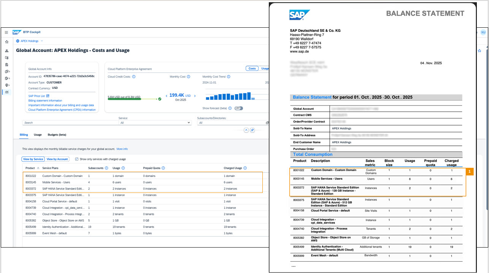
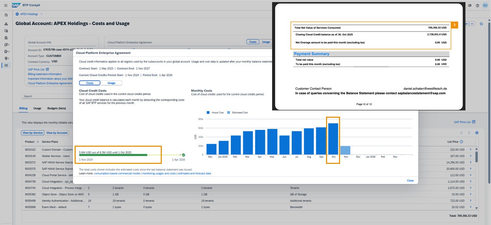

# Exercise 3 - Billing verification

In this section, you will explore the **BTP Cockpit Costs and Usage** interface and cross-check the data with the **Balance Statement**.

## Exercise 3.1 - Orientation

1. In the **BTP Cockpit**, under the left pane navigate to the last page -> **Costs and Usage**
2. Click on this button in the top left corner  to collapse the left pane and expand the viewing area.
3. In the header section, within the **Global Account Info** card (card on the left), click the **"Billing Statement Information"** link. This link directs you to **SAP for Me**, where you can download the **Balance Statement**.

   For this exercise, there is no need to download the Balance Statement, as we have provided screenshots for reference.
4. In the same card, click the link **"Important information about your billing and usage data"**.
5. You will see that the global account is licensed for both the **consumption-based** and **subscription-based** commercial models. This means that billing is structured so that the **prepaid quota** from your subscription is utilized first, after which any excess usage is charged under the **consumption-based model**.
6. In the header, locate the **Cloud Platform Enterprise Agreement** card (card on the right), which displays information about **Cloud Credits**, including costs, status, and trends.

7. You can use the **BTP Cockpit Billing** (see screen shot above) view to display, monitor, and analyze your monthly charges of billable services, which have been consumed by the subaccounts in your global account over the last 12 months. The **Billing** view is split into two perspectives:
   - **View by Service** – more suitable for billing verification as it presents all the services ordered as in the balance statement to enable easy analysis of the service costs and usage.
   - **View by Account** – better suited for cross charging as it presents the account hierarchy including subaccounts and directories to enable analysis of the account entity costs and usage.

## Exercise 3.2 - Compare the Balance Statement and SAP BTP Cockpit Information

The **Balance Statement** (available in **SAP for Me**) is the starting point for cross-checking the **BTP** cost information. It is recommended to verify the **Balance Statement** monthly against the **BTP Cockpit Billing** view. After completing this verification, you can proceed to investigate and further analyze cost details within the **BTP Cockpit**.

**Screenshot #1: Balance Statement - Total Consumption Section**

For this exercise, screenshots from the October 2025 **Balance Statement** are provided.

**Note:** The **Balance Statement** is divided into several sections, indicated by the blue headings.

1. In the **Costs and Usage**, the default view displays **Billing → View By Service**. You can see that the list is automatically sorted by **Product (SKU)**, matching the order in the **Balance Statement**.
2. This view includes both services with and without costs for this month (see **List Price** column). The balance statement, however, displays only services with incurred costs. To focus on services with actual charges, select **"Show only services with charged usage."** Note that all services with cost of 0 will disappear from the list.
3. In screenshot #1 above, see the comparison of the **Usage**, **Prepaid Quota**, and **Charged Usage** columns for the first three services. You can see the same in the **Billing → View By Service**. If you are unsure what these columns represent, click the information icon for detailed explanations.

**Screenshot #2: Balance Statement - Cloud Platform Enterprise Agreement Section**

4. In screenshot #2 above, see the comparison of the **List Price** column for the first three services. You can see the same in the **Billing → View By Service**.
5. As you may see in the **Billing → View By Service**, the table aggregates the two sections from the balance statement into a single view. This enabled you to see the information per service together and drill down into the details of each service to better understand how its costs were generated.

**Screenshot #3: Balance Statement - Cloud Credits and Payment Summary**

6. In screenshot #3 above, see the comparison of the **'Total net value of service consumed'** 709,356.33 USD in the balance statement with the data in the **Cost and Usage** header. In the **Cost and Usage** header, you may find this information by expanding the **Cloud Platform Enterprise Agreement** card (card on the right). To view cloud credits used in October, hover over the October bar.
7. In screenshot #3 above, see the comparison of the **'Closing Cloud Credit balance as of 30, Oct 2025'** 2,736,931.0 USD in the balance statement with the information in **Cloud Platform Enterprise Agreement** card. In the card, you will find the cloud credits for the current period:
   - **Cloud credits allocated:** $8.3 M
   - **Cloud credits used:** $5.6 M
   - This means the **remaining cloud credits:** $2.7 M ($8.3 M − $5.6 M) like in the balance statement.

**Note:** Since there are remaining cloud credits, the balance statement shows a 'Net Overage Amount' of 0. This indicates there are no overages, and therefore you can see in the "Payment Summary", no additional costs to be paid.

Did the billing verification confirm that all charges are accurate?

**Yes**

*The billing verification confirms that all charges are accurate. The data in the BTP Cockpit Costs and Usage page matches the Balance Statement across all sections, including total consumption, cloud credits usage, and prepaid quota. This verification establishes confidence in the billing data and provides a solid foundation for further cost analysis and optimization efforts.*

## Exercise 3.3 - Analyze the Overall Global Account Cost Trend

1. Scroll down to view the graph presenting the **Global Account - Cost Summary** and choose **View By: List Price**. Here you may see the cost trend of the global account costs for the last 12 months.

   

   
Which month has the highest costs over the last 12 months?

   **October**

   *October represents the previous month and shows the highest costs over the last 12 months, indicating a significant increase in consumption. This trend warrants further investigation to understand the drivers behind the cost increase, which will be explored in the next exercise on monitoring and analyzing costs.*
   

2. Hover to see the estimated costs in November.

> [!NOTE]
> In November (current month), the estimated costs are displayed as striped bars. These values cover the period between the last balance statement and today. They are considered estimates because they are based on raw resource usage data before final aggregation for billing (not forecast values). Once the billing cycle closes and a new Balance Statement is issued, the values are finalized and will no longer appear as striped bars.

## Summary

### 🎯 Key Takeaways

- ✅ Basic navigation in the BTP Cockpit Costs and Usage interface
- ✅ Compare balance statement data with BTP Cockpit information systematically
- ✅ Verify service costs across different billing sections
- ✅ Calculate and validate cloud credit balances
- ✅ Basic analysis of cost trends and identify anomalies

Following Apex's previous cost reduction project, a steady increase in costs has been observed from June to October. We will explore the reasons behind this trend in the next section.

---

[← Previous: Exercise 2 - TechEd - Apex Holdings Scenario](../ex2/) | [Continue to: Exercise 4 - Monitoring cost and consumption →](../ex4/)
