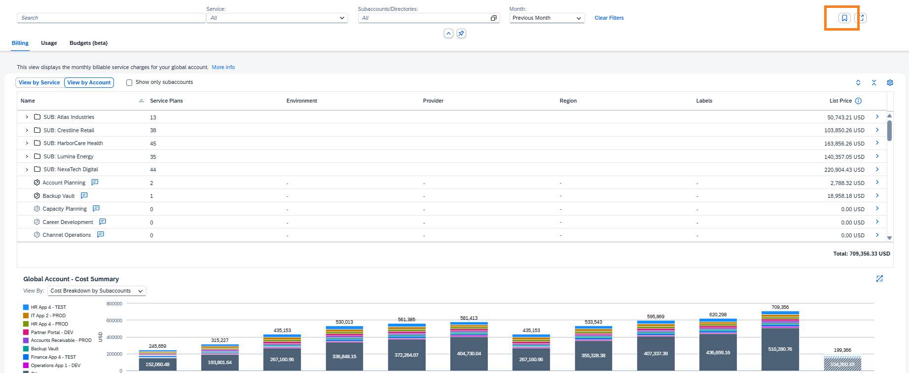

# Exercise 5 - Cross charge / cost allocation (approx. 10 minutes)

## Exercise 5.1 - Introduction

**Cross charging** is an internal cost allocation practice where one part of an organization charges another for shared services or resources. It ensures fair cost distribution and helps each business unit reflect the true expense of what it consumes.

In this section, you will track costs within the Apex account hierarchy to effectively share and distribute expenses across the organization. This process primarily utilizes the account structure, along with search and filter options based on **labels** defined in Apex Holdings (Contact Person, Cost Center, Department, Environment and Region).

You may also use the option available to export the data to **Excel** for further tracking and cross charging. This optional exercise is available at the end of the hands-on session (if time permits).

## Exercise 5.2 - Track costs and cross charge using the Account hierarchy

1. In the **Costs and Usage** header, ensure that the filter for **Month** is set to the previous month.
2. Ensure that you are in the **Billing → View by Account** and click on the **collapse all** button to view the **Account hierarchy**. This is the same account structure you saw via the Account Explorer in Exercise 2.
3. You will see 5 **Subsidiaries** and a list of subaccounts. These are subaccounts that had cost or usage during the last 12 months and were deleted.
4. Select subsidiary **NexaTech Digital**, what is the cumulative list price in the last 12 months?

   

   
<b>Hint</b>

   Scroll down to the graph and choose **View by: Cumulative List Price**.

   

   

   
<b>Answer</b>

   **1,887,337.35 USD**

   *This represents the total cumulative list price for the NexaTech Digital subsidiary over the last 12 months, providing a comprehensive view of the BTP costs of this subsidiary. This information is valuable for overall tracking of costs and understanding the cost distribution across subsidiaries.*

   

5. Unselect subsidiary NexaTech Digital.
6. Which subaccount had the highest costs in the previous month?

   

   
<b>Hint</b>

   Select "Show only subaccounts" and sort the List Price column in descending order to organize the services by cost.

   

   

   
<b>Answer</b>

   **HR App 4 – TEST**

   *This subaccount has the highest costs in the previous month, which may indicate an opportunity for optimization or further investigation into the cost drivers.*

   

7. Which is the costliest service plan they used?

   

   
<b>Hint</b>

   Select HR App 4 – TEST subaccount and scroll down to the graph, choose View by: Cost Breakdown by Service Plans.

   

   

   
<b>Answer</b>

   **SAP Integration Suite, advanced event mesh - Default**

   *The "SAP Integration Suite, advanced event mesh - Default" service plan is responsible for most of the costs in the HR App 4 – TEST subaccount. It's important to investigate whether this level of resource usage is expected, or if there are optimization, configuration, or cost control opportunities to reduce unnecessary spending.*

   

8. To investigate this subaccount – view the labels assigned to it.
9. You may contact the owner of this subaccount to inform them that they have crossed the 40k USD in the previous month. Who is the contact person?

    

    
<b>Hint</b>

    View the labels of this subaccount.

    

    

    
<b>Answer</b>

    **logan.ibrahim@apex.com**

    *Logan Ibrahim is the designated contact person for this subaccount and should be notified about the significant cost increase, particularly since the subaccount has exceeded 40,000 USD in the previous month. Reaching out to the contact person enables collaborative discussion about the cost drivers and potential optimization strategies.*

    

10. View the Environment label for this subaccount. Notice that it's labeled as "Test", indicating this is a testing environment. This is noteworthy because test environments typically incur significantly lower costs than production environments, yet this subaccount has the highest costs in the previous month.

11. Unselect the subaccount and deselect the "Show only subaccounts".

## Exercise 5.3 - Cross charge using Labels

1. Ensure that the filter for Month is set to the previous month.

2. As you saw, subaccount HR App 4 - TEST is in EMEA. What are the overall costs for the Apex EMEA region?

   

   
<b>Hint</b>

   Type in the search box Region and choose Region: EMEA or you may search for EMEA

   

   

   
<b>Answer</b>

   **362,710.05 USD**

   *This is the total cost for the Apex EMEA region in the previous month. The Apex EMEA Region label enables regional cost tracking and cross-charging, which is essential for multi-regional organizations to understand geographic cost distribution and allocate expenses appropriately to regional teams.*

   

3. Bookmark the Apex EMEA region for future tracking by clicking on the bookmark button (see highlighted in screenshot). This allows you to copy the link, save it for future use and send it to others (e.g. Apex EMEA region owner) for further tracking.

   
## Summary

### 🎯 Key Takeaways

- ✅ Navigate and analyze costs across organizational hierarchy to compare cost distribution
- ✅ Use labels (Environment, Region, Department, Cost Center, Contact Person) to filter and aggregate costs for flexible reporting
- ✅ Calculate accurate costs for cross-charging using the account hierarchy and labels 
- ✅ Bookmark and share key information for ongoing tracking and collaboration

---

[← Previous: Exercise 4 - Monitoring cost and consumption](../ex4/) | [Continue to: Exercise 6 - Controlling Costs Using Budgets →](../ex6/)
